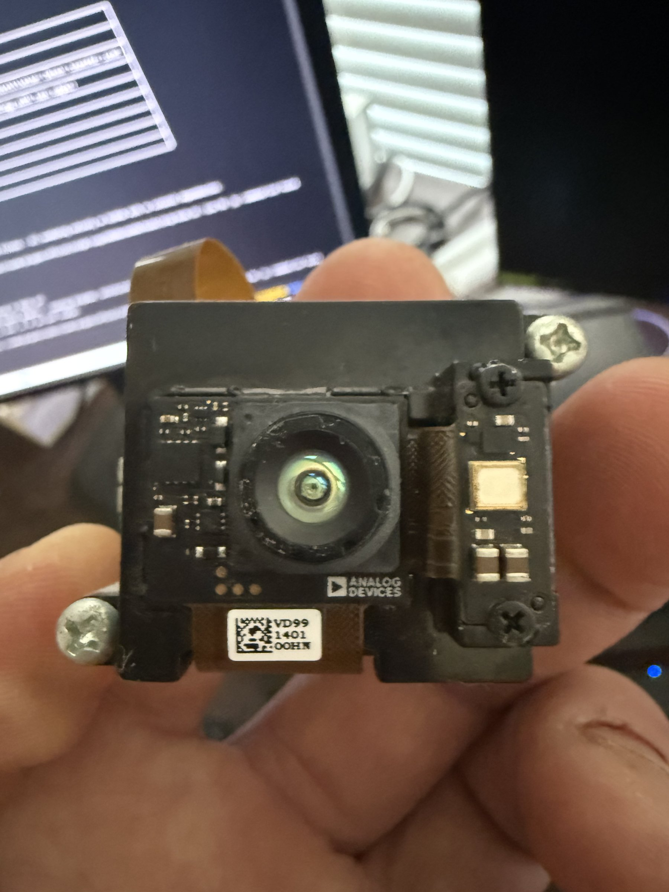

# Analog Devices Time-of-Flight Camera Module

## Overview
A compact Time-of-Flight (ToF) depth-sensing camera module manufactured by Analog Devices. This module uses infrared light to measure distances and create 3D depth maps. The unit features an IR emitter, ToF sensor, and lens assembly in a small form factor with a flex cable interface. The label indicates "VD99 1401 00HN" and bears the Analog Devices logo.

## Identification
| Field | Value |
|-------|-------|
| Manufacturer | Analog Devices |
| Part Marking | VD99 1401 00HN |
| Type | Time-of-Flight Depth Camera Module |
| Interface | Flex Cable (FPC) |
| Power | Via host board |

## Images
| Image | Description |
|-------|-------------|
|  | Front view showing IR lens, emitter array, Analog Devices logo, and flex cable connector |

## Technical Specifications
- **Sensor Type**: ToF (Time-of-Flight) infrared depth sensor
- **Illumination**: IR VCSEL/LED flood illuminator
- **Interface**: Flexible Printed Circuit (FPC) connector
- **Components**: IR camera lens, IR emitter, proximity sensor
- **Form Factor**: Compact module (~25x25mm) with mounting screws
- **Depth Technology**: Indirect ToF (iToF) or Direct ToF (dToF)

## Development Interfaces
- **FPC Connector**: Flat flex cable for data and power (connects to evaluation board or custom host)
- **I2C/SPI**: Likely configuration interface (via FPC)
- **MIPI CSI-2**: Probable depth data output (via FPC)
- **GPIO**: Interrupt/trigger lines (via FPC)

## Capabilities
- 3D depth mapping and point cloud generation
- Distance measurement with millimeter precision
- Gesture recognition input
- Object detection and proximity sensing
- Indoor 3D scanning
- Works in complete darkness (active IR illumination)

## Potential Development Projects
1. **3D Room Scanner**: Pair with a servo pan-tilt mechanism to create full 3D room scans and point clouds
2. **Gesture Control Interface**: Implement hand gesture recognition for contactless device control
3. **Robotics Obstacle Avoidance**: Mount on a robot platform for real-time depth-based navigation
4. **People Counter/Tracker**: Build a ceiling-mounted people counting and tracking system
5. **Volumetric Measurement Tool**: Measure package dimensions automatically using depth data

## Getting Started

### Required Tools
- Analog Devices evaluation board (or compatible host with FPC connector)
- USB cable for evaluation board
- Analog Devices ToF SDK / software development kit
- Python with numpy/OpenCV for depth data visualization

### Initial Setup
1. Identify the exact evaluation platform this module pairs with
2. Connect via FPC to the host/evaluation board
3. Install the Analog Devices ToF SDK and drivers
4. Run the provided depth viewer application to verify functionality
5. Explore the API for custom depth processing applications

## References
- Analog Devices ToF product portfolio
- AD-96TOF1-EBZ or similar evaluation board documentation
- Analog Devices 3D ToF software SDK
