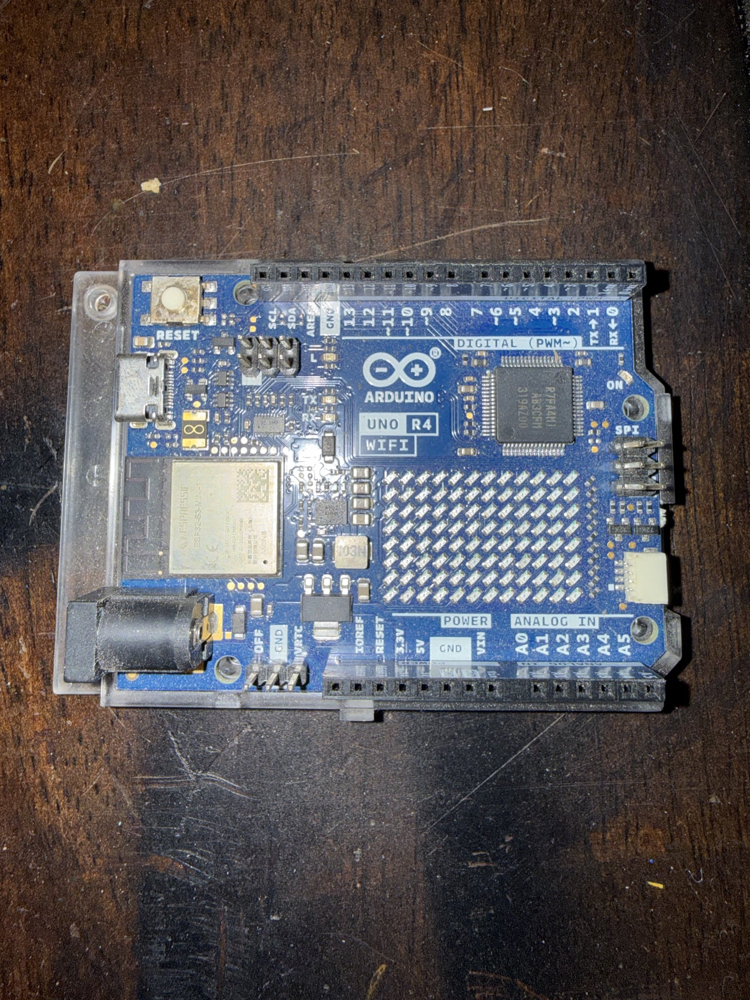

# Arduino UNO R4 WiFi

## Overview
The Arduino UNO R4 WiFi is the latest evolution of the iconic Arduino UNO platform, featuring a significant upgrade from the classic ATmega328P to the Renesas RA4M1 (ARM Cortex-M4) microcontroller running at 48 MHz. It adds WiFi and BLE connectivity via an onboard ESP32-S3 module, a 12x8 LED matrix display, and maintains full backward compatibility with existing UNO shields and the Arduino ecosystem. This board bridges the gap between classic Arduino simplicity and modern IoT capabilities.

## Identification
| Field | Value |
|-------|-------|
| Manufacturer | Arduino |
| Model | UNO R4 WiFi |
| Type | Microcontroller Development Board |
| MCU | Renesas RA4M1 (ARM Cortex-M4F, 48 MHz) |
| WiFi/BLE | ESP32-S3 co-processor |
| Power | USB-C or barrel jack (6-24V) |

## Images
| Image | Description |
|-------|-------------|
|  | Top view showing the complete board with Arduino logo, Renesas RA4M1 MCU, ESP32-S3 WiFi module, RESET button, barrel jack, pin headers, and SPI header |

## Technical Specifications
- **Main MCU**: Renesas RA4M1 (ARM Cortex-M4F, 48 MHz, FPU)
- **WiFi/BLE MCU**: ESP32-S3 (dual-core Xtensa LX7, 240 MHz)
- **Flash**: 256 KB (RA4M1) + 384 KB (ESP32-S3)
- **SRAM**: 32 KB (RA4M1) + 512 KB (ESP32-S3)
- **Digital I/O**: 14 pins (6 PWM)
- **Analog Input**: 6 pins (14-bit ADC, up to 5V)
- **Analog Output**: 1 DAC pin (12-bit)
- **LED Matrix**: 12x8 red LED array
- **USB**: USB-C (programming and power)
- **Power Jack**: Barrel connector (6-24V DC)
- **Operating Voltage**: 5V
- **WiFi**: 802.11 b/g/n (2.4 GHz)
- **Bluetooth**: BLE 5.0
- **CAN Bus**: Built-in CAN peripheral (via transceiver)

## Development Interfaces
- **USB-C**: Programming, serial monitor, and power
- **Digital Headers**: 14 GPIO pins (Arduino UNO pinout compatible)
- **Analog Headers**: 6 analog inputs + power pins
- **SPI**: Dedicated SPI header (ICSP)
- **I2C**: SDA/SCL (also on Qwiic/STEMMA QT connector)
- **UART**: Hardware serial on pins 0/1
- **CAN**: CAN TX/RX pins available
- **DAC**: True analog output on A0
- **WiFi/BLE**: Via ESP32-S3 co-processor

## Capabilities
- WiFi connectivity for IoT and cloud applications
- Bluetooth Low Energy for short-range wireless
- 12x8 LED matrix for visual feedback and animations
- 14-bit ADC for high-resolution analog sensing
- 12-bit DAC for true analog output
- CAN bus for automotive/industrial communication
- Real-time clock (RTC)
- HID keyboard/mouse emulation over USB
- Full Arduino ecosystem and shield compatibility
- Dual-processor architecture (RA4M1 + ESP32-S3)

## Potential Development Projects
1. **IoT Weather Station**: Read environmental sensors, display data on LED matrix, and push to cloud via WiFi
2. **CAN Bus Vehicle Data Logger**: Tap into OBD-II via CAN bus, log and display vehicle diagnostics over WiFi
3. **LED Matrix Notification Display**: Show scrolling text notifications, alerts, and animations from cloud services
4. **BLE-Controlled Home Automation Hub**: Control relays, read sensors, and interface with BLE accessories
5. **Real-Time Audio Spectrum Analyzer**: Use the 14-bit ADC for audio input and display spectrum on the LED matrix

## Getting Started

### Required Tools
- USB-C cable
- Arduino IDE 2.x (with Arduino UNO R4 board package)
- Arduino Cloud account (optional, for IoT integration)
- Compatible shields and sensors (5V logic)

### Initial Setup
1. Download Arduino IDE 2.x from arduino.cc
2. Install the "Arduino UNO R4 Boards" package via Board Manager
3. Connect the board via USB-C
4. Select "Arduino UNO R4 WiFi" as the target board
5. Upload the Blink sketch to verify connectivity
6. Try the WiFi examples: WiFiScan, WiFiWebServer
7. Explore the LED matrix examples in the Arduino_LED_Matrix library

## References
- Arduino UNO R4 WiFi product page (arduino.cc)
- Arduino UNO R4 WiFi documentation and pinout
- Renesas RA4M1 datasheet
- ESP32-S3 technical reference
- Arduino_LED_Matrix library documentation
