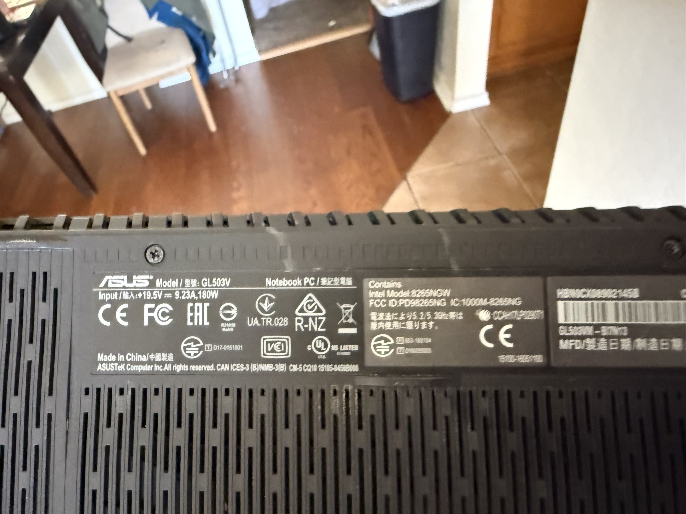

# ASUS ROG Strix GL503V Gaming Laptop

## Overview
The ASUS ROG Strix GL503V is a gaming laptop from the Republic of Gamers (ROG) lineup. It features a powerful Intel processor, dedicated NVIDIA graphics, and a 180W power supply indicating high-performance GPU (likely GTX 1060 or GTX 1070). The laptop includes Intel Wireless-AC 8265 (8265NGW) for WiFi connectivity. This machine is suitable for development workloads including ML training, game development, and GPU-accelerated computing.

## Identification
| Field | Value |
|-------|-------|
| Manufacturer | ASUSTeK Computer Inc. |
| Model | GL503V |
| Type | Gaming Notebook PC |
| Power | 19.5V, 9.23A, 180W |
| WiFi | Intel Wireless-AC 8265NGW |
| FCC ID | PD98265NG |
| Origin | Made in China |

## Images
| Image | Description |
|-------|-------------|
|  | Bottom label showing ASUS GL503V model info, power specs (180W), Intel 8265NGW WiFi, and regulatory markings |

## Technical Specifications
- **Processor**: Intel Core i7 (7th/8th gen, specific model TBD)
- **GPU**: NVIDIA GeForce GTX 1060/1070 (180W adapter suggests high-end)
- **Display**: 15.6" FHD (1920x1080), 120Hz or 144Hz
- **RAM**: Up to 32 GB DDR4
- **Storage**: M.2 NVMe SSD + 2.5" SATA bay
- **WiFi**: Intel Wireless-AC 8265 (802.11ac, 2x2 MIMO)
- **Bluetooth**: 4.2
- **Ports**: USB 3.1, USB-C, HDMI, Mini DisplayPort, Ethernet, SD reader
- **Keyboard**: RGB backlit with per-key illumination
- **Battery**: 64Wh (approx.)

## Development Interfaces
- **USB 3.1**: High-speed peripheral connectivity
- **USB-C**: Additional connectivity (may support Thunderbolt on some variants)
- **HDMI/Mini-DP**: External display output
- **Ethernet**: Gigabit Ethernet for reliable networking
- **M.2 Slot**: NVMe SSD for fast storage
- **SD Card Reader**: Convenient data transfer
- **WiFi/BLE**: Wireless development and testing

## Capabilities
- GPU-accelerated computing (CUDA) for ML/AI workloads
- Game development with modern graphics support
- Multi-display output for productivity
- High-speed storage for large datasets
- Portable development workstation
- Linux dual-boot capable

## Potential Development Projects
1. **ML Training Workstation**: Set up PyTorch/TensorFlow with CUDA for GPU-accelerated model training
2. **Game Development Environment**: Install Unity/Unreal Engine for game prototyping
3. **GPU Computing Testbed**: Develop and benchmark CUDA or OpenCL compute kernels
4. **Portable Penetration Testing Platform**: Configure with Kali Linux for authorized security testing
5. **Docker Development Server**: Run containerized microservices for development and testing

## Getting Started

### Required Tools
- 180W AC adapter (original ASUS charger)
- USB peripherals as needed
- Linux bootable USB (for dual-boot setup)
- NVIDIA driver package

### Initial Setup
1. Boot the laptop and verify hardware functionality
2. Update BIOS to latest version from ASUS support
3. Install/update NVIDIA GPU drivers
4. Set up development environment (IDE, compiler toolchain)
5. For ML: Install CUDA toolkit, cuDNN, and Python ML frameworks
6. Consider dual-booting with Ubuntu for Linux development

## References
- ASUS GL503V support page (asus.com)
- NVIDIA CUDA toolkit documentation
- Intel Wireless-AC 8265 specifications
- ROG Strix GL503 user manual
