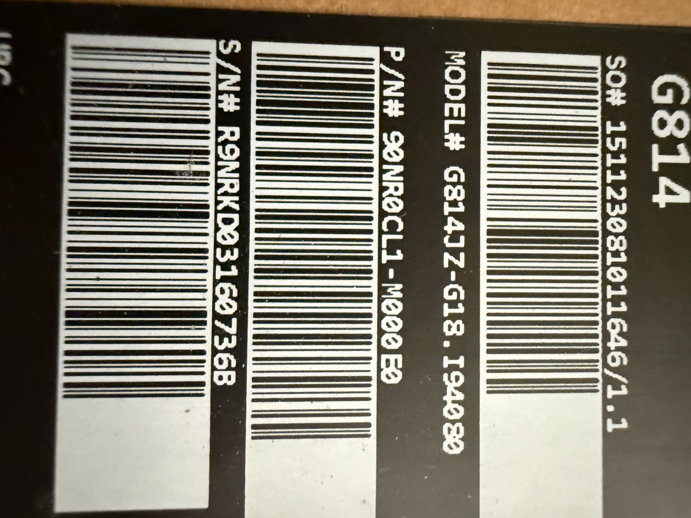

# ASUS ROG Zephyrus G14 (G814)

## Overview
The ASUS ROG Zephyrus G14 (model G814JZ) is a high-performance 14-inch gaming and creator laptop from the Republic of Gamers lineup. The "JZ" suffix and model number G814JZ-G18.I940B0 indicate a 2024 model with Intel processor and likely NVIDIA RTX 40-series GPU. The Zephyrus G14 is renowned for packing desktop-class performance into a compact, portable 14-inch form factor, making it ideal as a powerful mobile development workstation.

## Identification
| Field | Value |
|-------|-------|
| Manufacturer | ASUS (Republic of Gamers) |
| Model | G814JZ-G18.I940B0 |
| Series | ROG Zephyrus G14 (2024) |
| Type | Gaming/Creator Notebook |
| Part Number | 90NR0CL1-M000E0 |
| Serial | R9NRK031607368 |

## Images
| Image | Description |
|-------|-------------|
|  | Box/unit label showing G814 identifier, MODEL# G814JZ-G18.I940B0, P/N and S/N barcodes |

## Technical Specifications
- **Processor**: Intel Core i9-14900H (or similar 14th gen, 14 cores/20 threads)
- **GPU**: NVIDIA GeForce RTX 4060/4070 Laptop (based on JZ suffix)
- **Display**: 14" QHD+ (2560x1600) or higher, 165Hz, OLED or Mini-LED
- **RAM**: 16-32 GB DDR5
- **Storage**: 1 TB NVMe PCIe 4.0 SSD
- **WiFi**: WiFi 6E or WiFi 7
- **Battery**: 76Wh
- **Weight**: ~1.7 kg
- **Ports**: USB-C (Thunderbolt 4), USB-A 3.2, HDMI 2.1, SD card reader

## Development Interfaces
- **Thunderbolt 4**: High-speed data, charging, eGPU support
- **USB-C**: USB 3.2 Gen 2 with DisplayPort Alt Mode
- **USB-A 3.2**: Standard peripheral connectivity
- **HDMI 2.1**: 4K@120Hz external display output
- **SD Card Reader**: Media transfer
- **WiFi 6E/7**: High-speed wireless development and testing

## Capabilities
- Powerful GPU computing (CUDA, RT cores, Tensor cores)
- Compact 14" form factor with desktop-class performance
- Premium display for accurate color work and code readability
- All-day battery life for mobile development (76Wh)
- Thunderbolt 4 for eGPU and dock connectivity
- Excellent thermal design for sustained performance
- MUX switch for optimal GPU performance

## Potential Development Projects
1. **Portable ML Workstation**: Train models on-the-go with RTX 40-series GPU and CUDA
2. **Game Development on the Move**: Full Unreal Engine 5 / Unity development with real-time ray tracing
3. **Creative Content Pipeline**: 3D modeling, video editing, and rendering with GPU acceleration
4. **Full-Stack Development Hub**: Run Docker, databases, and IDE with ample resources
5. **Streaming Development Setup**: Develop and test with NVENC hardware encoding for streaming

## Getting Started

### Required Tools
- USB-C PD charger (100W+ recommended) or included AC adapter
- Thunderbolt dock for expanded connectivity
- External monitor (via HDMI 2.1 or USB-C)

### Initial Setup
1. Complete initial OS setup
2. Update BIOS and Armoury Crate software from ASUS
3. Install latest NVIDIA GPU drivers
4. Configure performance profiles (Silent, Performance, Turbo via Armoury Crate)
5. Install development tools and CUDA toolkit
6. Set up WSL2 or dual-boot Linux for development

## References
- ASUS ROG Zephyrus G14 (2024) product page
- ROG Zephyrus G14 user manual and specs
- NVIDIA laptop GPU specifications
- Armoury Crate software downloads
