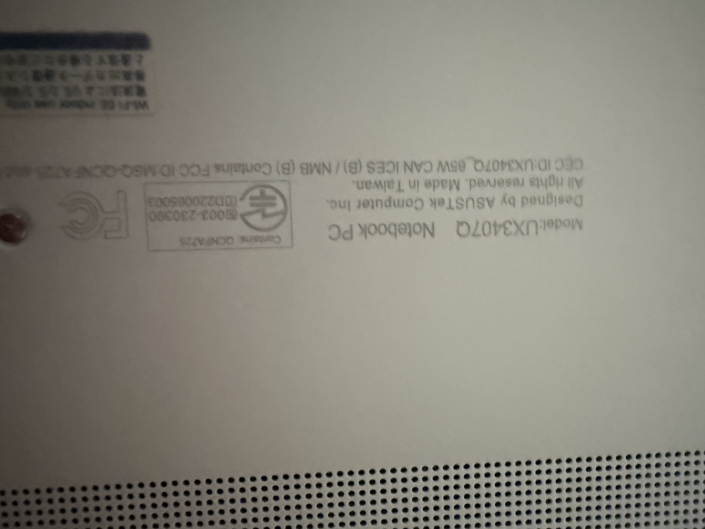

# ASUS ZenBook UX3407Q

## Overview
The ASUS ZenBook UX3407Q is a premium ultrabook designed for productivity and portability. Made in Taiwan, this notebook features a Qualcomm QCNFA725 wireless module, suggesting WiFi 5 and Bluetooth support. The ZenBook line is known for ultra-thin design, high-resolution displays, and long battery life, making it an excellent portable development machine for coding, web development, and lightweight compute tasks.

## Identification
| Field | Value |
|-------|-------|
| Manufacturer | ASUSTeK Computer Inc. |
| Model | UX3407Q |
| Type | Ultrabook Notebook PC |
| WiFi | Qualcomm QCNFA725 |
| FCC ID | MSQ-QCNFA725 |
| CEC ID | UX3407Q |
| Origin | Made in Taiwan |

## Images
| Image | Description |
|-------|-------------|
|  | Bottom label (upside-down) showing Model UX3407Q, Qualcomm QCNFA725 wireless, ASUSTeK Computer Inc., Made in Taiwan |

## Technical Specifications
- **Processor**: Intel Core (likely Ultra series or 13th/14th gen)
- **Display**: 14" (based on UX340x naming), likely OLED or IPS, high resolution
- **RAM**: 16-32 GB LPDDR5 (soldered)
- **Storage**: M.2 NVMe SSD (512GB-1TB)
- **WiFi**: Qualcomm QCNFA725 (802.11ac, WiFi 5)
- **Bluetooth**: 5.0+
- **Battery**: 70-75Wh (typical for ZenBook 14")
- **Weight**: ~1.2-1.4 kg
- **Ports**: USB-C (Thunderbolt), USB-A, HDMI, SD reader

## Development Interfaces
- **USB-C/Thunderbolt**: High-speed connectivity and external GPU support
- **USB-A**: Standard peripheral connectivity
- **HDMI**: External display output
- **WiFi/BLE**: Wireless development and testing
- **Thunderbolt**: eGPU dock support for GPU-accelerated workloads

## Capabilities
- Ultra-portable development workstation
- All-day battery life for mobile development
- High-resolution display for code readability
- Thunderbolt for external GPU or dock connectivity
- Light enough for daily carry
- Linux-compatible (most ZenBooks run Linux well)

## Potential Development Projects
1. **Mobile Development Station**: Set up Android Studio or Xcode (via VM) for mobile app development on the go
2. **Web Development Environment**: Configure VS Code + Docker for full-stack web development
3. **Remote Development Terminal**: Use as a thin client for SSH-based development on remote servers
4. **Cloud IDE Workstation**: Run cloud-based development environments (GitHub Codespaces, Gitpod)
5. **Technical Writing Platform**: Leverage the high-res display for documentation, diagramming, and content creation

## Getting Started

### Required Tools
- USB-C charger (65W PD recommended)
- USB hub/dock for expanded connectivity
- Linux bootable USB (for dual-boot setup if desired)

### Initial Setup
1. Boot and complete Windows/Linux initial setup
2. Update BIOS and drivers from ASUS support
3. Install development tools (IDE, Git, Docker, etc.)
4. Configure Thunderbolt settings if using a dock
5. Set up backup/sync for portable development workflow

## References
- ASUS ZenBook 14 (UX3407Q) support page
- Qualcomm QCNFA725 specifications
- ASUS BIOS updates and driver downloads
