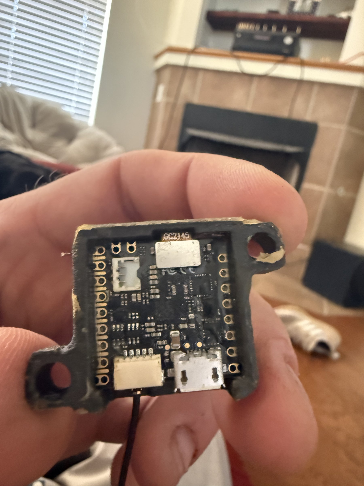
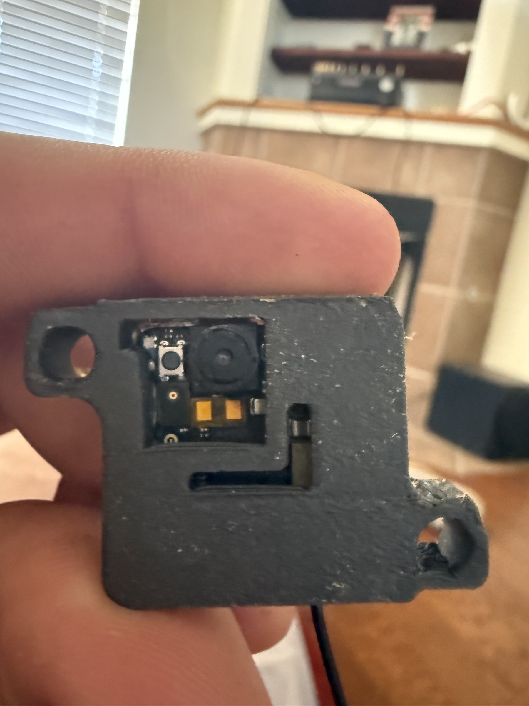

# BLE Camera/Sensor Module

## Overview
A compact custom or prototype board featuring a BLE wireless chip and an integrated camera/sensor assembly, housed in a 3D-printed enclosure with mounting holes. The PCB (marking "8C2345") includes a micro-USB connector, JST battery connector, and a wire antenna. The other side of the enclosure reveals a camera lens and IR/proximity sensor cutout. This appears to be a wireless camera or vision sensor module, possibly from a small drone, wearable, or IoT camera platform.

## Identification
| Field | Value |
|-------|-------|
| Board Marking | 8C2345 |
| Type | BLE Wireless Camera/Sensor Module |
| Enclosure | 3D-printed with mounting holes |
| Interface | Micro-USB, JST battery connector |
| Wireless | BLE (wire antenna) |

## Images
| Image | Description |
|-------|-------------|
|  | Back of module showing PCB with "8C2345" marking, BLE chip, micro-USB port, JST connector, and wire antenna |
|  | Front of module showing camera lens and IR/proximity sensor through the 3D-printed enclosure cutout |

## Technical Specifications
- **Wireless**: Bluetooth Low Energy (wire antenna)
- **Camera**: Small CMOS camera module (visible through front cutout)
- **Sensors**: IR/proximity sensor (adjacent to camera)
- **Power**: Micro-USB or LiPo battery (via JST connector)
- **PCB**: Custom/prototype black PCB with SMD components
- **Enclosure**: 3D-printed mounting bracket with two screw holes
- **Antenna**: Soldered wire antenna for BLE

## Development Interfaces
- **Micro-USB**: Programming and charging
- **JST Connector**: LiPo battery connection
- **Wire Antenna**: BLE radio
- **Possible UART/SWD**: Test points may be available on PCB

## Capabilities
- Wireless image capture over BLE
- Battery-powered portable operation
- Proximity/IR sensing
- Compact form factor for embedded deployment
- 3D-printed enclosure allows custom mounting solutions

## Potential Development Projects
1. **Wireless Doorbell Camera**: Deploy as a compact BLE-connected camera for entry monitoring
2. **Wildlife Camera Trap**: Battery-powered motion-triggered photo capture with BLE data transfer
3. **Wearable Point-of-View Camera**: Mount on equipment or clothing for first-person capture
4. **Proximity-Triggered Recorder**: Use IR sensor to trigger camera capture when objects are detected
5. **Drone FPV Module**: Integrate with a small drone frame for wireless first-person-view imaging

## Getting Started

### Required Tools
- Micro-USB cable
- LiPo battery (single cell 3.7V with JST connector)
- BLE scanner app (nRF Connect or similar)
- Logic analyzer (for reverse-engineering the serial interface if needed)

### Initial Setup
1. Connect via micro-USB to power the module
2. Scan for BLE advertisements using nRF Connect
3. Identify the BLE services and characteristics exposed
4. Attempt to connect and discover image/data transfer capabilities
5. If custom firmware is needed, identify debug test points on the PCB

## References
- Identify the specific BLE chip (CC2345 or similar) for SDK access
- nRF Connect mobile app for BLE debugging
- BLE specification for image transfer profiles
