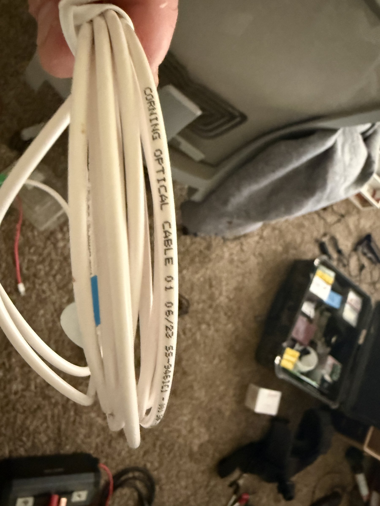
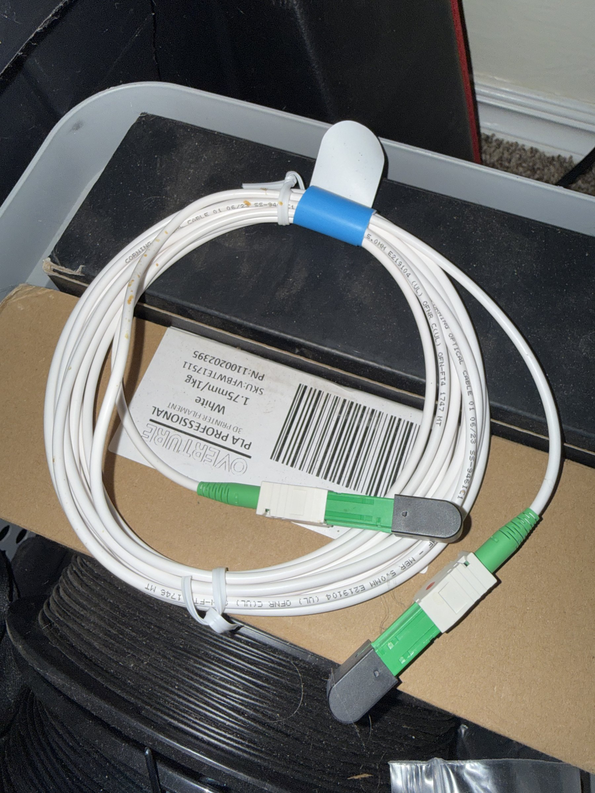

# Corning Fiber Optic Cables

## Overview
A set of Corning fiber optic cables for high-speed optical networking. The collection includes a bulk Corning Optical Cable spool and a pre-terminated patch cable with SC/APC (Angled Physical Contact) green connectors. These are single-mode fiber cables suitable for telecommunications, FTTH (Fiber-to-the-Home), data center, and networking applications. The patch cable has SC/APC connectors on both ends with a duplex adapter.

## Identification
| Field | Value |
|-------|-------|
| Manufacturer | Corning Incorporated |
| Type | Fiber Optic Cables |
| Cable 1 | Corning Optical Cable (bulk, dated 06/22) |
| Cable 2 | SC/APC terminated patch cable |
| Fiber Type | Single-mode (indicated by yellow/green SC/APC connectors) |

## Images
| Image | Description |
|-------|-------------|
|  | Corning Optical Cable coil with "CORNING OPTICAL CABLE 01 06/22" printing, white jacket |
|  | Pre-terminated patch cable with green SC/APC connectors, duplex adapter, coiled on PLA filament spool |

## Technical Specifications

### Bulk Cable
- **Type**: Corning Optical Cable, single-mode
- **Jacket**: White
- **Date Code**: 06/22 (June 2022)
- **Construction**: Tight-buffered or loose-tube (typical for Corning outdoor/indoor)

### Patch Cable
- **Connectors**: SC/APC on both ends (green ferrule = APC, 8° angled polish)
- **Fiber**: Single-mode 9/125 μm (OS2)
- **Wavelength**: 1310nm / 1550nm
- **Insertion Loss**: <0.3 dB per connector (typical SC/APC)
- **Return Loss**: >60 dB (APC advantage)

## Development Interfaces
- **SC/APC Connectors**: Standard single-mode fiber interface
- **Duplex Adapter**: For connecting two SC/APC cables inline
- **Compatible Equipment**: SFP/SFP+ modules, ONT, OLT, media converters

## Capabilities
- High-bandwidth optical data transmission (up to 100 Gbps+)
- Long-distance signal transmission (up to 80 km+ single-mode)
- Low-latency networking
- EMI immune (optical signal, no electromagnetic interference)
- SC/APC connectors minimize back-reflection (critical for GPON/WDM)

## Potential Development Projects
1. **Home Lab Fiber Network**: Build a fiber-connected home network between rooms using media converters
2. **GPON/Fiber Internet Lab**: Set up a test GPON network with OLT/ONT equipment for learning fiber ISP technology
3. **High-Speed Data Link**: Create a dedicated fiber link between servers/workstations for maximum throughput
4. **Fiber Sensing Experiment**: Explore fiber optic sensing (temperature, strain) using the cable as a sensor medium
5. **Network Monitoring Testbed**: Set up fiber taps for network analysis and security monitoring

## Getting Started

### Required Tools
- SFP/SFP+ transceivers (single-mode, 1310nm or 1550nm)
- Media converter or switch with SFP slots
- Fiber cleaning kit (lint-free wipes, IPA)
- Optical power meter (for link verification)
- SC/APC patch panels or adapters

### Initial Setup
1. Clean all fiber connectors before use (critical for signal quality)
2. Insert SC/APC connectors into SFP transceivers or patch panels
3. Verify link integrity with an optical power meter
4. Connect to network equipment (switch, router, media converter)
5. Test throughput with iperf3 or similar tool

## References
- Corning Optical Cable product catalog
- SC/APC connector specifications (TIA-568)
- Single-mode fiber (OS2, ITU-T G.652) specifications
- SFP/SFP+ transceiver compatibility guides
