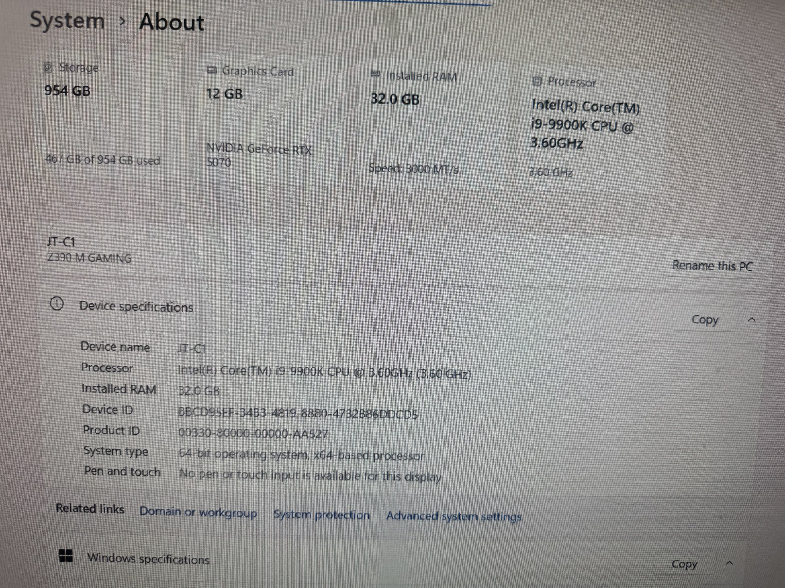

# Custom Desktop PC — JT-C1

## Overview
A custom-built high-performance desktop workstation named "JT-C1". Built on an MSI Z390 M GAMING motherboard, it features an Intel Core i9-9900K processor (8 cores/16 threads at 3.60 GHz), 32 GB of RAM, an NVIDIA GeForce RTX 5070 with 12 GB VRAM, and 954 GB of storage. This is a powerful development and compute machine suitable for GPU-accelerated workloads including machine learning, 3D rendering, game development, and heavy compilation tasks.

## Identification
| Field | Value |
|-------|-------|
| Device Name | JT-C1 |
| Motherboard | MSI Z390 M GAMING |
| Type | Custom Desktop Workstation |
| Processor | Intel Core i9-9900K |
| GPU | NVIDIA GeForce RTX 5070 (12 GB) |
| RAM | 32.0 GB |
| Storage | 954 GB (467 GB used) |

## Images
| Image | Description |
|-------|-------------|
|  | Windows System > About screenshot showing full specs: i9-9900K, 32GB RAM, RTX 5070 12GB, Z390 M GAMING, 954GB storage |

## Technical Specifications
- **CPU**: Intel Core i9-9900K @ 3.60 GHz (8 cores / 16 threads, turbo to 5.0 GHz)
- **GPU**: NVIDIA GeForce RTX 5070 12 GB VRAM (Ada Lovelace / Blackwell architecture)
- **RAM**: 32.0 GB DDR4 (3000 MT/s)
- **Motherboard**: MSI Z390 M GAMING (LGA 1151, Micro-ATX)
- **Storage**: 954 GB total (likely 1TB NVMe SSD)
- **OS**: Windows (64-bit, x64-based processor)
- **Chipset**: Intel Z390 (Coffee Lake)
- **Connectivity**: Gigabit Ethernet, USB 3.1 Gen 2, USB-C

## Development Interfaces
- **PCIe x16**: GPU slot (RTX 5070 installed)
- **PCIe x1**: Additional expansion slots
- **M.2**: NVMe SSD slot(s)
- **USB 3.1 Gen 2**: High-speed peripherals (10 Gbps)
- **USB-C**: Modern peripheral connectivity
- **Gigabit Ethernet**: Reliable wired networking
- **HDMI/DisplayPort**: Multiple display outputs via RTX 5070
- **SATA III**: Additional storage connections

## Capabilities
- CUDA GPU computing with RTX 5070 (12 GB VRAM)
- RT cores for real-time ray tracing development
- Tensor cores for AI/ML acceleration
- 8-core/16-thread CPU for heavy compilation and multithreading
- 32 GB RAM for large datasets and virtual machines
- NVMe storage for fast build times and data access
- Multi-monitor support for productivity
- Overclocking capability (Z390 + K-series CPU)

## Potential Development Projects
1. **ML/AI Training Rig**: Set up PyTorch/TensorFlow with CUDA 12.x for training large models on 12 GB VRAM
2. **Game Engine Development**: Develop and test Unreal Engine 5 or Unity projects with ray tracing
3. **Docker/Kubernetes Lab**: Run multi-container orchestration with ample RAM and CPU cores
4. **3D Rendering Farm Node**: Use for Blender or other GPU-accelerated 3D rendering
5. **LLM Inference Server**: Run quantized large language models locally (GGUF/GPTQ models up to ~12GB)
6. **Compilation Server**: Use as a fast CI build server for large C++/Rust projects
7. **Virtual Machine Host**: Run multiple VMs with Hyper-V or VMware for testing different OS environments

## Getting Started

### Required Tools
- Monitor (DisplayPort or HDMI)
- Keyboard and mouse
- Ethernet cable or WiFi adapter
- NVIDIA GPU driver (latest from nvidia.com)

### Initial Setup
1. Verify all hardware is functional (POST, BIOS access)
2. Update BIOS to latest Z390 M GAMING version from MSI
3. Install/update NVIDIA RTX 5070 drivers
4. Install CUDA Toolkit 12.x and cuDNN for GPU computing
5. Set up WSL2 or dual-boot Linux for development
6. Install Docker Desktop for containerized development
7. Configure NVIDIA Container Toolkit for GPU-accelerated containers

## References
- MSI Z390 M GAMING motherboard manual
- Intel Core i9-9900K specifications (ark.intel.com)
- NVIDIA RTX 5070 specifications and driver downloads
- CUDA Toolkit documentation (developer.nvidia.com)
