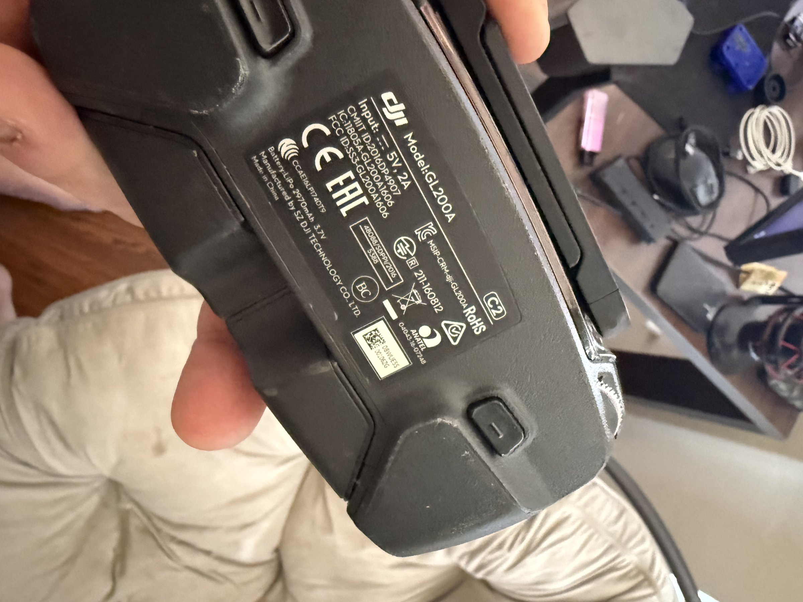

# DJI Mavic Pro Remote Controller (GL200A)

## Overview
The DJI GL200A is the remote controller for the DJI Mavic Pro drone. It features an integrated display cradle for smartphones, dual control sticks, and operates on enhanced WiFi/OcuSync for long-range drone communication. The controller houses a 2970mAh 3.7V internal battery and accepts 5V/2A USB charging. Manufactured by SZ DJI Technology Co., Ltd., this is a key component for UAV development and drone telemetry experimentation.

## Identification
| Field | Value |
|-------|-------|
| Manufacturer | SZ DJI Technology Co., Ltd. |
| Model | GL200A |
| Type | Drone Remote Controller |
| FCC ID | SS3-GL200A606 |
| Input | 5V, 2A (USB charging) |
| Battery | 2970mAh, 3.7V LiPo |
| Compatible Drone | DJI Mavic Pro |

## Images
| Image | Description |
|-------|-------------|
|  | Back label showing DJI logo, Model GL200A, FCC ID, power specs, battery info, and regulatory markings |

## Technical Specifications
- **Communication**: OcuSync / Enhanced WiFi (2.4 GHz / 5.8 GHz)
- **Range**: Up to 7 km (FCC) / 4 km (CE)
- **Video Downlink**: 720p/1080p live feed
- **Battery**: Built-in 2970mAh 3.7V LiPo
- **Charging**: USB 5V/2A
- **Controls**: Dual joysticks, C1/C2 buttons, gimbal dial, 5D button
- **Phone Mount**: Foldable clamp (accommodates phones up to 6.5")
- **Ports**: Micro-USB (charging), USB (phone connection), Lightning/USB-C adapters
- **Telemetry**: GPS coordinates, altitude, speed, battery, signal strength

## Development Interfaces
- **USB Port**: Data connection to mobile device (Android/iOS)
- **Micro-USB**: Charging and potential serial access
- **DJI Mobile SDK**: Software interface for custom ground station apps
- **Telemetry Stream**: Real-time flight data accessible via SDK
- **Video Feed**: H.264/H.265 video stream decodable via SDK

## Capabilities
- Long-range drone command and control
- Real-time HD video feed reception
- GPS telemetry monitoring
- Gimbal camera control (pitch, yaw)
- Programmable function buttons (C1, C2)
- Return-to-Home triggering
- Flight mode switching (Sport, Tripod, Normal)
- Custom ground station development via DJI SDK

## Potential Development Projects
1. **Custom Ground Station App**: Build a specialized ground station using DJI Mobile SDK for automated mission planning
2. **Telemetry Data Logger**: Capture and log all flight telemetry (GPS, altitude, battery, signal) for post-flight analysis
3. **Computer Vision Pipeline**: Process the live video feed in real-time for object detection or tracking
4. **Autonomous Mission Planner**: Develop waypoint-based autonomous flight paths with custom triggers
5. **FPV Video Recorder/Streamer**: Build a custom app that records or live-streams the drone's video feed

## Getting Started

### Required Tools
- DJI Mavic Pro drone (paired with this controller)
- Smartphone (Android or iOS)
- DJI Go 4 app (or DJI Fly)
- DJI Mobile SDK (for development)
- Micro-USB cable for charging
- USB cable for phone connection

### Initial Setup
1. Charge the controller via micro-USB (5V/2A)
2. Install DJI Go 4 app on your phone
3. Connect phone to controller via USB
4. Power on controller and pair with drone
5. For development: install DJI Mobile SDK and create a DJI developer account
6. Build a sample project using the SDK to access telemetry and video

## References
- DJI Mavic Pro specifications page
- DJI Mobile SDK documentation (developer.dji.com)
- DJI Go 4 application
- OcuSync communication protocol overview
