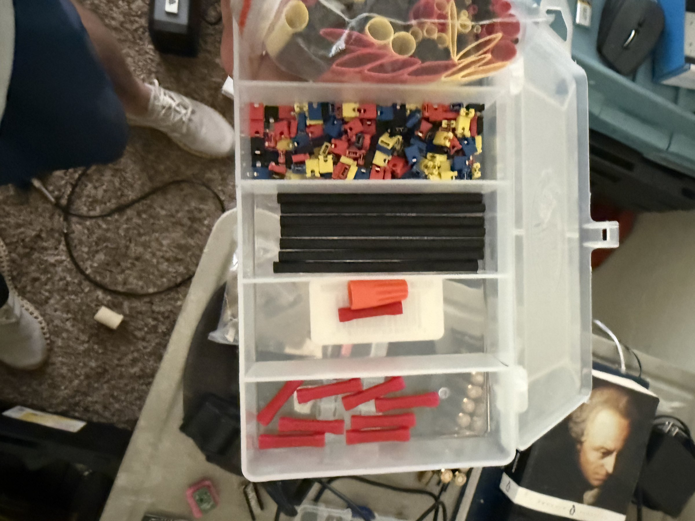

# Electronics Components Kit

## Overview
An organized plastic parts bin containing various electrical connectors, heat shrink tubing, and small components for electronics prototyping and wiring projects. The kit includes Anderson Powerpole-style connectors (red, blue, yellow, black), assorted heat shrink tubing in multiple diameters, wire nuts, and miscellaneous small adapters. This is a general-purpose electronics supplies kit for building cables, making connections, and prototyping.

## Identification
| Field | Value |
|-------|-------|
| Type | Electronics Connectors & Supplies Kit |
| Container | Clear plastic multi-compartment organizer |
| Contents | Anderson Powerpole connectors, heat shrink tubing, wire nuts, adapters |

## Images
| Image | Description |
|-------|-------------|
|  | Plastic organizer showing compartments with colored Anderson Powerpole connectors (red/blue/yellow/black), heat shrink tubing (black/red), wire nuts, and various small components |

## Contents Inventory

### Anderson Powerpole Connectors
- **Red**: Multiple units (15A/30A/45A)
- **Blue**: Multiple units
- **Yellow**: Multiple units
- **Black**: Multiple units
- **Type**: Genderless, stackable DC power connectors
- **Rating**: Typically 15A-45A depending on contact size

### Heat Shrink Tubing
- **Black**: Various diameters (appears 3mm-8mm)
- **Red**: Various diameters
- **Shrink Ratio**: Typically 2:1 or 3:1

### Other Components
- Wire nuts (orange/red)
- Small adapters and connectors
- Miscellaneous hardware

## Capabilities
- Quick, reliable DC power connections (Anderson Powerpole)
- Professional cable insulation and strain relief (heat shrink)
- Color-coded connections for easy identification
- Genderless connectors allow flexible wiring configurations
- Multiple amperage ratings for different power levels

## Potential Development Projects
1. **Standardized Power Distribution**: Build a power distribution panel using Anderson Powerpole connectors for a lab bench
2. **Custom Cable Harness**: Create professional-grade cable assemblies for development boards and projects
3. **Portable Power System**: Wire battery packs with Powerpole connectors for hot-swappable portable power
4. **Ham Radio Power Bus**: Standard Powerpole bus for amateur radio equipment
5. **Prototyping Wire Kit**: Organize pre-made jumper wires with proper heat shrink termination

## Getting Started

### Required Tools
- Powerpole crimping tool (dedicated crimp die recommended)
- Heat gun or lighter for heat shrink tubing
- Wire strippers (for 10-22 AWG)
- Multimeter for continuity testing

### Usage Tips
1. Use the correct contact size for your wire gauge (15A: 16-20 AWG, 30A: 12-16 AWG, 45A: 10-14 AWG)
2. Crimp Powerpole contacts properly — a good crimp is gas-tight
3. Slide heat shrink over connections before crimping, then shrink after
4. Follow ARES/RACES color conventions: red = positive, black = negative
5. Stack Powerpoles in the standard orientation for interoperability

## References
- Anderson Powerpole connector specifications
- ARES/RACES standard Powerpole wiring convention
- Heat shrink tubing sizing guide
