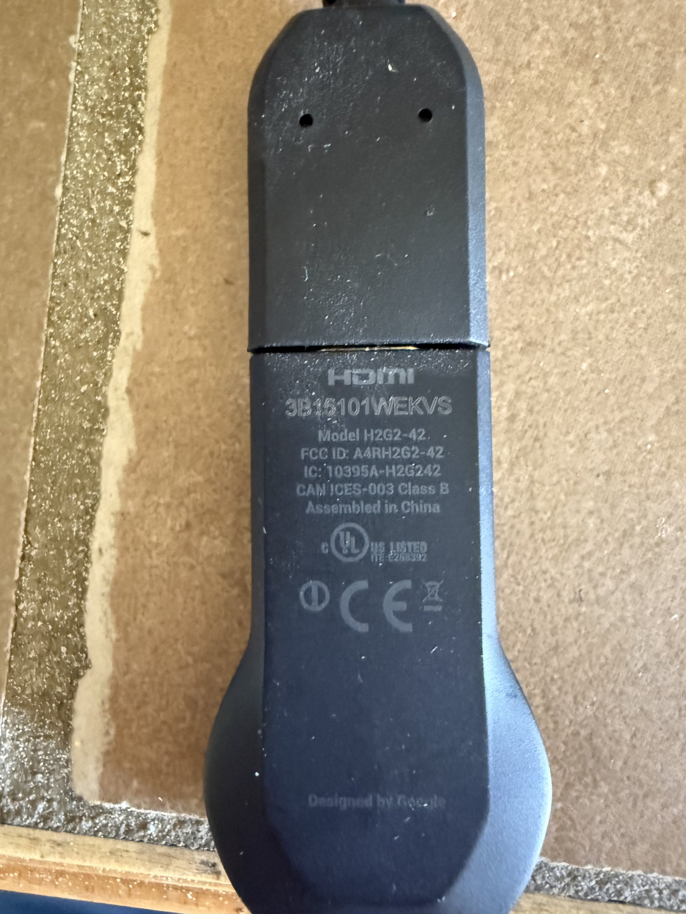

# Google Chromecast (2nd Generation)

## Overview
The Google Chromecast 2nd Generation (model H2G2-42) is a streaming media dongle designed by Google. It plugs into a TV's HDMI port and enables casting of audio/video content from smartphones, tablets, and computers over WiFi. The device supports Google Cast protocol and can be used for development with the Google Cast SDK for building custom casting applications and receiver apps.

## Identification
| Field | Value |
|-------|-------|
| Manufacturer | Google |
| Model | H2G2-42 |
| Type | HDMI Streaming Media Dongle |
| FCC ID | A4RH2G2-42 |
| IC | 10395A-H2G242 |
| Compliance | CAN ICES-003 Class B, UL Listed |
| Origin | Assembled in China, Designed by Google |

## Images
| Image | Description |
|-------|-------------|
|  | Back of device showing HDMI logo, Model H2G2-42, FCC ID, IC numbers, "Designed by Google" marking |

## Technical Specifications
- **SoC**: Marvell Armada 1500 Mini Plus (88DE3006)
- **RAM**: 256 MB DDR3
- **Storage**: 256 MB internal flash
- **WiFi**: 802.11ac (2.4 GHz + 5 GHz)
- **Output**: HDMI 1.4b (1080p max)
- **Audio**: Dolby Digital Plus 5.1 passthrough
- **Power**: Micro-USB (5V/1A)
- **Protocols**: Google Cast, DIAL, mDNS
- **OS**: Simplified Chrome OS-based firmware

## Development Interfaces
- **HDMI**: Video/audio output to display
- **Micro-USB**: Power input
- **WiFi**: Network connectivity and cast receiving
- **Google Cast SDK**: Software interface for custom sender/receiver apps
- **DIAL Protocol**: Discovery and Launch protocol
- **mDNS**: Service discovery on local network

## Capabilities
- Receive cast streams from any Google Cast-enabled app
- Custom receiver application hosting (via Google Cast SDK)
- Screen mirroring from Android devices and Chrome browser
- Multi-room audio synchronization (with multiple units)
- Digital signage display (via custom receiver)
- Guest mode casting
- Background media display (Google Photos, art)

## Potential Development Projects
1. **Custom Digital Signage**: Build a Cast receiver app for displaying custom dashboards, metrics, or announcements on a TV
2. **IoT Control Display**: Create a cast-enabled interface for controlling smart home devices displayed on a TV
3. **Multi-Screen Presentation System**: Develop a casting app for synchronized multi-display presentations
4. **Development Dashboard TV**: Build a custom receiver that displays CI/CD status, monitoring dashboards, or code metrics
5. **Media Streaming App**: Develop a custom sender app that casts media from a local server to the Chromecast

## Getting Started

### Required Tools
- TV or monitor with HDMI input
- Micro-USB power supply (5V/1A minimum)
- WiFi network
- Google Home app (iOS/Android) for initial setup
- Chrome browser (for Cast SDK development)

### Initial Setup
1. Plug into TV HDMI port and connect micro-USB power
2. Download Google Home app on your phone
3. Follow setup wizard to connect Chromecast to WiFi
4. Test casting from YouTube or Chrome browser
5. For development: register at Google Cast SDK developer console
6. Build a custom receiver app using the Cast Application Framework (CAF)
7. Test sender apps using the Chrome browser Cast extension

## References
- Google Cast SDK documentation (developers.google.com/cast)
- Cast Application Framework (CAF) receiver guide
- Google Home app for device setup
- Chromecast technical specifications
