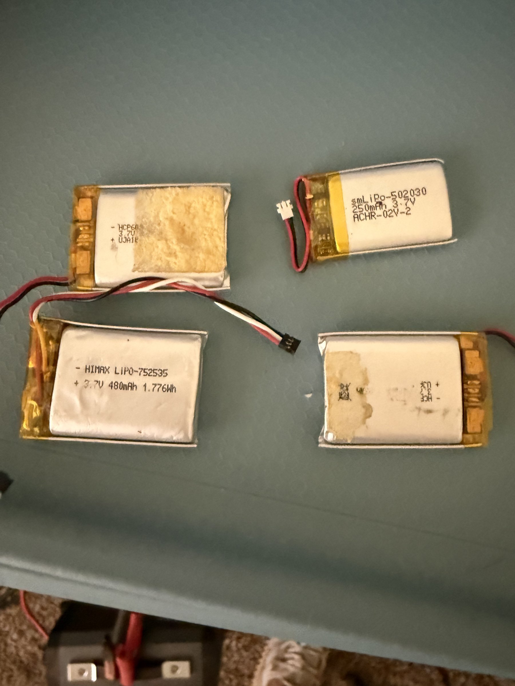
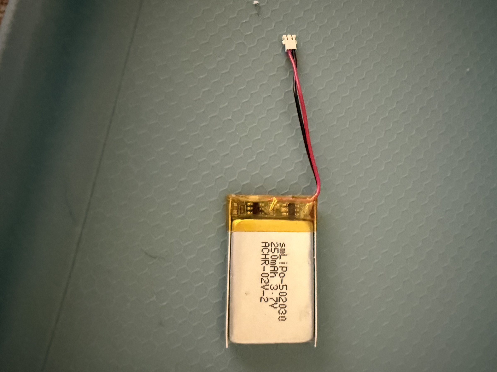

# LiPo Battery Collection

## Overview
A collection of single-cell 3.7V Lithium Polymer (LiPo) batteries in various capacities, suitable for powering small electronics projects, IoT devices, wearables, and prototypes. The collection includes at least four different batteries with JST and similar connectors, ranging from 250mAh to 480mAh. These are standard hobby/prototyping batteries commonly used with Arduino, ESP32, STM32, and similar development boards.

## Identification
| Field | Value |
|-------|-------|
| Type | Single-cell LiPo Batteries (3.7V nominal) |
| Battery 1 | SM LiPo-502030, 250mAh 3.7V, ACHR-02V-2 connector |
| Battery 2 | HIMAX LIPO-752535, 480mAh 3.7V, 1.776Wh, 3-pin JST |
| Battery 3 | HCP68 3.7V (capacity partially readable) |
| Battery 4 | Additional LiPo (markings worn) |

## Images
| Image | Description |
|-------|-------------|
|  | Four LiPo batteries laid out: HCP68 (top-left), SM LiPo-502030 250mAh (top-right), HIMAX LIPO-752535 480mAh (bottom-left), unmarked (bottom-right) |
|  | Close-up of SM LiPo-502030, 250mAh 3.7V battery with 2-pin JST connector |

## Technical Specifications

### SM LiPo-502030 (250mAh)
- **Voltage**: 3.7V nominal (4.2V fully charged, 3.0V cutoff)
- **Capacity**: 250mAh
- **Dimensions**: 5.0 x 20 x 30 mm (502030 format)
- **Connector**: ACHR-02V-2 (2-pin JST-style)
- **Protection**: Likely includes built-in protection circuit

### HIMAX LIPO-752535 (480mAh)
- **Voltage**: 3.7V nominal
- **Capacity**: 480mAh (1.776Wh)
- **Dimensions**: 7.5 x 25 x 35 mm (752535 format)
- **Connector**: 3-pin JST (power + thermistor)
- **Energy**: 1.776 Wh

## Development Interfaces
- **JST Connectors**: Standard 2-pin or 3-pin JST-PH for direct board connection
- **Wire Leads**: Red (+) and Black (-) wires, typically 26-28 AWG
- **Charge Voltage**: 4.2V max (requires LiPo charge controller)
- **Discharge Cutoff**: 3.0V minimum (avoid over-discharge)

## Capabilities
- Portable power for small electronics projects
- Rechargeable via TP4056 or similar charge controllers
- Compact and lightweight
- Various capacities for different runtime needs
- JST connectors compatible with most dev boards

## Potential Development Projects
1. **Portable Sensor Node Power**: Power the ST SensorTile or BLE modules for portable deployment
2. **Battery Management System**: Build a custom BMS with monitoring and protection circuits
3. **Solar-Charged IoT Node**: Combine with a small solar panel and charge controller for self-sustaining sensors
4. **Wearable Electronics Power**: Use the 250mAh for compact wearable projects
5. **Battery Capacity Tester**: Build an Arduino-based battery capacity and discharge curve tester

## Getting Started

### Required Tools
- LiPo charge controller module (TP4056 recommended)
- Multimeter for voltage measurement
- JST connectors/adapters (match battery connector type)
- LiPo-safe charging bag (safety)

### Initial Setup
1. Measure each battery's voltage with a multimeter
2. Charge any depleted batteries using a TP4056 module (do not charge below 3.0V without recovery mode)
3. Match JST connector types to your target development boards
4. Test runtime with your intended load
5. Always monitor temperature during charging

### Safety Notes
- Never short-circuit LiPo batteries
- Never charge above 4.2V per cell
- Never discharge below 3.0V per cell
- Store at ~3.7V (storage voltage) when not in use
- Use a LiPo-safe bag during charging
- Dispose of puffy or damaged batteries properly

## References
- LiPo battery safety guidelines
- TP4056 charge controller datasheet
- JST connector specifications (PH, SH, ACHR series)
- Battery capacity testing methodologies
