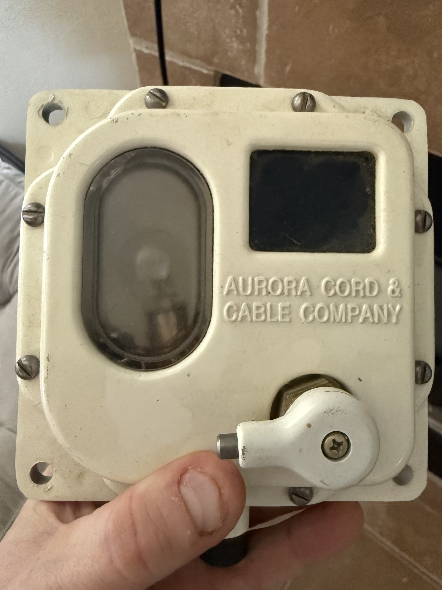

# Military Dome Light — MIL-L-45068 (MS-51073-1)

## Overview
A military-specification dome light built to MIL-L-45068 standards, manufactured by Aurora Cord & Cable Company. This 24-volt interior lighting unit (MS-51073-1) is designed for military vehicles, shelters, and field equipment. It features a white dome housing with a sealed lens, a lever on/off switch, and rugged construction for harsh-environment deployment. NSN 6220-00-337-7463 places it in the military illumination equipment category. Dated November 2003.

## Identification
| Field | Value |
|-------|-------|
| Manufacturer | Aurora Cord & Cable Company |
| Military Spec | MIL-L-45068 |
| Part Number | MS-51073-1 |
| NSN | 6220-00-337-7463 |
| MFR Code | 5A910 |
| Voltage | 24V DC |
| Date | November 2003 |
| Type | Military Dome Light |
| FSC | 6220 (Lighting Fixtures & Lamps) |

## Images
| Image | Description |
|-------|-------------|
|  | Front view showing white dome housing with "AURORA CORD & CABLE COMPANY" marking, sealed dome lens, lever switch |
| *(Add back label image)* | Back label showing MIL-L-45068, NSN 6220-00-337-7463, MS-51073-1, 24V, MFR 5A910, DATE NOV 2003 |

## Technical Specifications
- **Standard**: MIL-L-45068 (Military Lighting Fixtures)
- **Part**: MS-51073-1 (standard military dome light assembly)
- **Voltage**: 24V DC (military vehicle standard)
- **Bulb**: Incandescent or LED retrofit compatible
- **Housing**: Painted metal (white), sealed construction
- **Lens**: Polycarbonate or glass dome (impact-resistant)
- **Switch**: External lever (on/off)
- **Mounting**: Surface mount with integral flange, 2-4 screw holes
- **Environmental**: MIL-spec rated for vibration, moisture, temperature extremes
- **Weight**: ~200-300g

## Development Interfaces
- **Power Input**: 2-wire (24V DC positive + ground)
- **Switch**: SPST mechanical lever switch
- **Internal Access**: Remove dome lens to access bulb socket and wiring
- **Mounting Flange**: Standard surface-mount pattern

## Capabilities
- Military-grade interior lighting (vehicles, shelters, containers)
- 24V DC operation (standard military vehicle electrical)
- Sealed housing for dust/moisture protection
- Simple on/off lever switch
- Field-replaceable bulb
- Vibration and shock resistant mounting

## Potential Development Projects
1. **LED Retrofit Module**: Design a 24V LED driver board to replace the incandescent bulb with high-efficiency LEDs, adding dimming control
2. **Smart Military Light**: Add a microcontroller (XIAO nRF52840) for BLE-controlled dimming, color temperature, and scheduling
3. **IR/Blackout Mode Conversion**: Add an IR LED array for NVG-compatible lighting with a visible/IR mode switch
4. **Vehicle CAN Bus Integration**: Interface with a CAN transceiver to control lighting via military vehicle data bus
5. **Solar-Powered Field Light**: Pair with a small solar panel and LiPo battery for off-grid field lighting
6. **Ruggedized IoT Sensor Housing**: Repurpose the sealed enclosure to house environmental sensors for outdoor deployment

## Getting Started

### Required Tools
- 24V DC power supply (or 24V vehicle battery)
- Wire strippers and connectors
- Phillips screwdriver for housing access
- Multimeter for circuit testing

### Initial Setup
1. Inspect the housing — remove dome by unscrewing the retaining screws
2. Check the existing bulb type and socket
3. Test the lever switch for continuity
4. Apply 24V DC to power terminals and verify illumination
5. For LED retrofit: measure socket dimensions and plan the replacement module
6. For smart conversion: identify mounting space for a small controller board

## References
- MIL-L-45068 specification (military lighting fixtures)
- MS-51073-1 military standard drawing
- NSN 6220-00-337-7463 in Federal Supply Catalog
- Aurora Cord & Cable Company product information
- LED retrofit guides for military vehicle lighting
