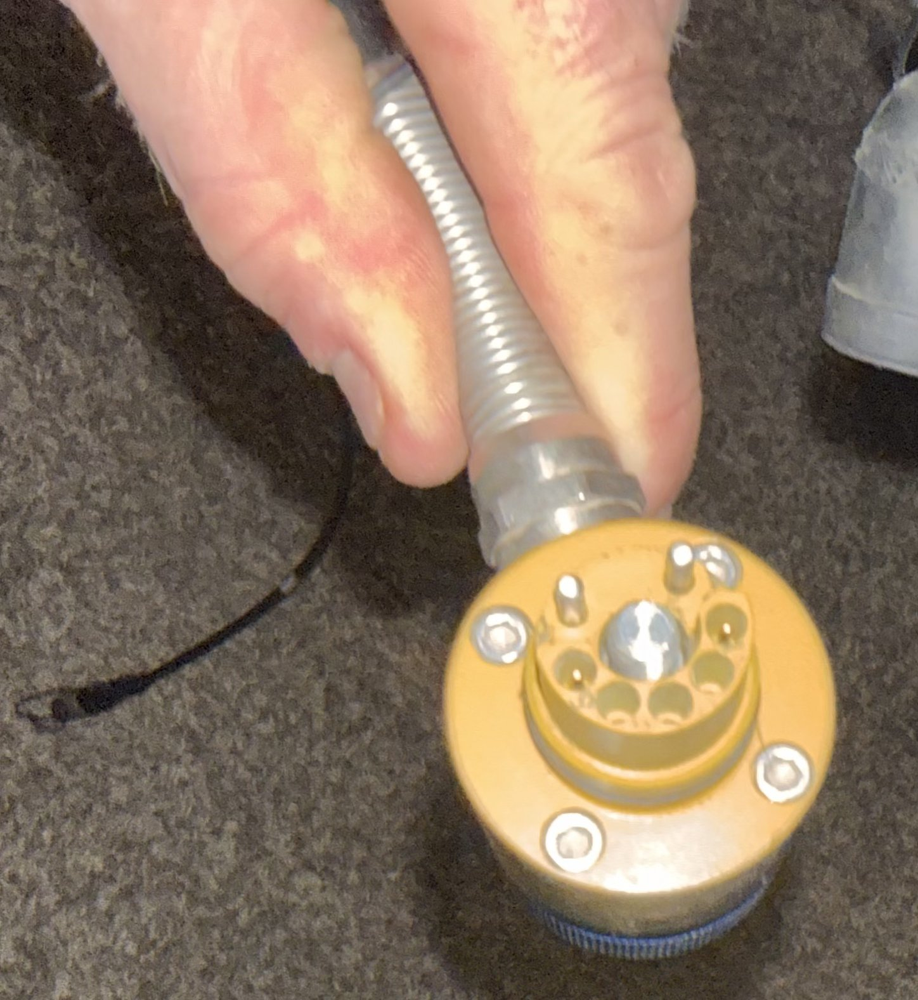
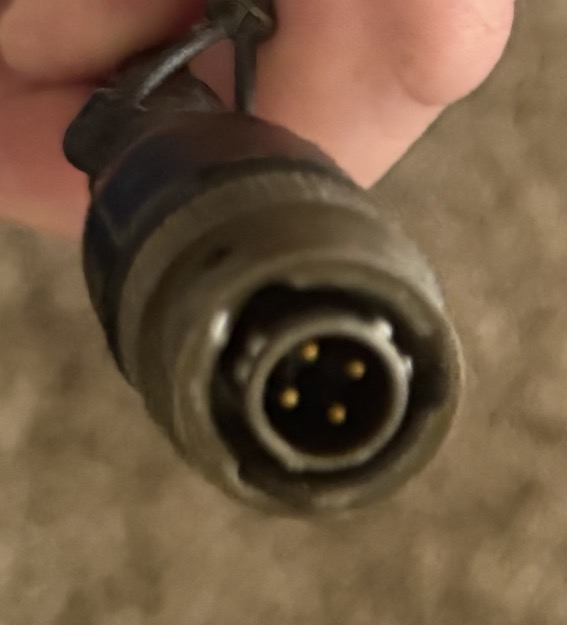

# Military-Spec Circular Connectors

## Overview
A collection of MIL-spec (military specification) circular connectors used for rugged, reliable electrical connections in military, aerospace, and industrial applications. The collection includes two connectors: a gold/yellow multi-pin connector with flexible conduit (approx. 8-10 pins), and an olive-drab 5-pin connector with cable. These are built to MIL-DTL-5015 or MIL-DTL-38999 standards for environmental sealing, vibration resistance, and EMI shielding.

## Identification
| Field | Value |
|-------|-------|
| Type | MIL-Spec Circular Connectors |
| Connector 1 | Gold/yellow housing, ~8-10 pin, with flexible conduit |
| Connector 2 | Olive drab, 5-pin, with cable (MS3106-style) |
| Standard | MIL-DTL-5015 / MIL-C-5015 family |
| Application | Military/aerospace electrical interconnect |

## Images
| Image | Description |
|-------|-------------|
|  | Gold/yellow housing circular connector with flexible metallic conduit, ~8-10 pins visible, threaded coupling ring |
|  | Olive drab 5-pin circular connector (MS3106-style), cable attached, bayonet or threaded coupling |

## Technical Specifications
- **Connector Type**: MIL-DTL-5015 series circular connectors
- **Shell Material**: Aluminum alloy (anodized)
- **Contact Material**: Gold-plated copper alloy
- **Pin Count**: 5-pin and 8-10 pin configurations
- **Coupling**: Threaded coupling ring (weather-sealed)
- **Environmental**: IP67+ rated, designed for extreme temperatures, vibration, and moisture
- **Voltage Rating**: Typically 500V-1500V AC/DC depending on pin size
- **Current Rating**: 5A-46A per contact depending on size

## Development Interfaces
- **Pin-to-wire**: Solder or crimp termination on cable side
- **Panel mount**: Threaded flange for chassis mounting
- **Mating**: Requires corresponding receptacle connector

## Capabilities
- Environmentally sealed connections for outdoor/field use
- Vibration and shock resistant
- EMI/RFI shielding capability
- High reliability in extreme temperatures (-55°C to +125°C)
- Keyed to prevent incorrect mating
- Suitable for power, signal, and data connections

## Potential Development Projects
1. **Rugged Field Data System**: Use as the external connector for a weatherproof data acquisition enclosure
2. **Military Radio Interface Adapter**: Build a breakout board to interface mil-spec radio equipment with modern dev boards
3. **Custom Cable Harness**: Create adapter cables between mil-spec and standard connectors for lab use
4. **Environmental Test Chamber Feedthrough**: Use as sealed feedthrough connectors for test equipment
5. **Vehicle Electronics Interface**: Integrate with mil-vehicle electrical systems for diagnostics or data tapping

## Getting Started

### Required Tools
- Mil-spec pin insertion/extraction tool
- Crimp tool for mil-spec contacts
- Mating receptacle connectors (match pin configuration)
- Multimeter for pin-to-pin continuity testing
- Heat shrink tubing for cable protection

### Initial Setup
1. Identify the exact MIL-spec part number (check shell markings or measure pin layout)
2. Obtain the matching receptacle connectors
3. Create a pinout map by tracing wires with a multimeter
4. Build adapter cables as needed for your application
5. Test continuity and insulation resistance before applying power

## References
- MIL-DTL-5015 specification
- MS3106 / MS3102 connector series reference
- Military connector pinout databases
- Amphenol / ITT Cannon mil-spec connector catalogs
