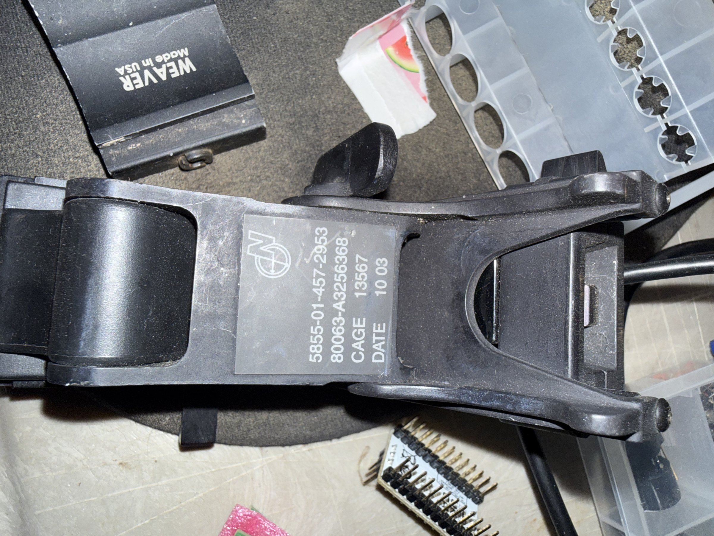
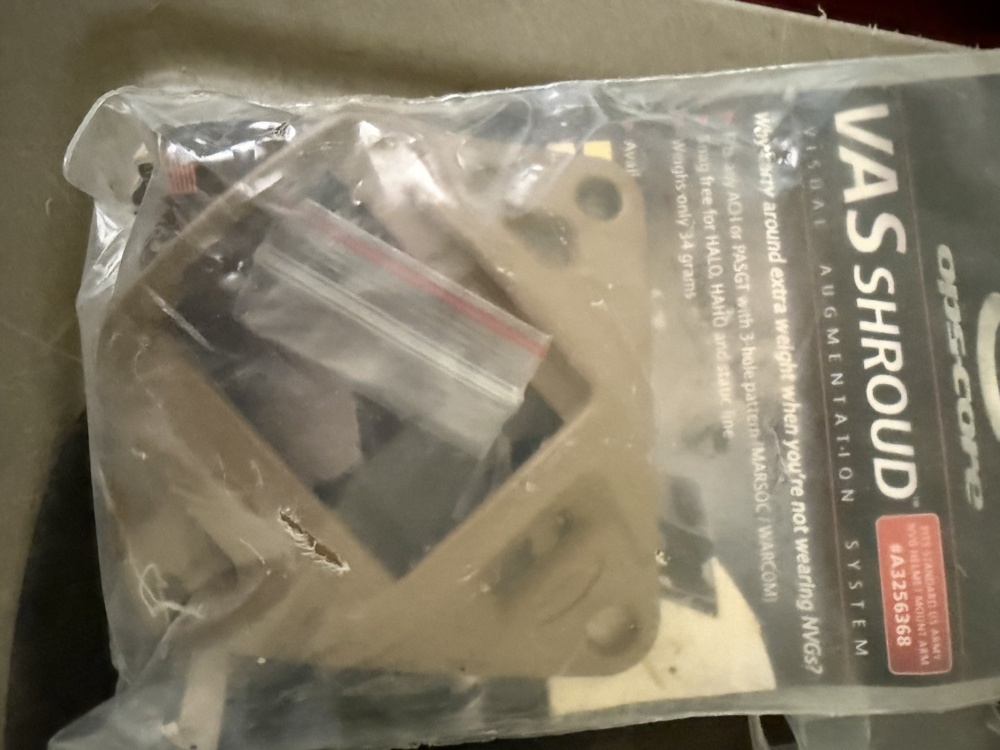

# NVG Mounting System (J-Arm + OpsCore VAS Shroud)

## Overview
A night vision goggle (NVG) mounting system consisting of two components: a military J-arm mount bracket and an OpsCore VAS (Visual Augmentation System) Shroud. The J-arm (NSN 5855-01-457-2953) is a standard military NVG mounting arm used to attach PVS-14 or similar monocular night vision devices to helmet shrouds. The OpsCore VAS Shroud is a lightweight (34g) universal helmet mount plate compatible with ACH, PASGT, HALO, HAHO, and MARSOC/WARCOM helmets with 3-hole patterns.

## Identification
| Field | Value |
|-------|-------|
| Component 1 | NVG J-Arm Mount |
| NSN | 5855-01-457-2953 |
| CAGE Code | 80063-A32563668 |
| Date | 10/03 (October 2003) |
| Component 2 | OpsCore VAS Shroud |
| Part # | A32563668 |
| Weight | 34 grams (shroud) |
| Compatibility | ACH, PASGT, HALO, HAHO, MARSOC/WARCOM |

## Images
| Image | Description |
|-------|-------------|
|  | NVG J-arm bracket showing NSN 5855-01-457-2953, CAGE code, date 10 03, with "WEAVER Made in USA" visible in background |
|  | OpsCore VAS Shroud in packaging showing "VISUAL AUGMENTATION SYSTEM" text, 3-hole pattern compatibility, and 34g weight |

## Technical Specifications

### J-Arm Mount
- **NSN**: 5855-01-457-2953 (Night Vision Equipment category)
- **Material**: Reinforced polymer/composite
- **Function**: Articulating arm to mount monocular NVG (PVS-14) to shroud
- **Adjustment**: Flip-up/flip-down with detent positions
- **Interface**: Standard dovetail shoe (male) on NVG side, bayonet mount on shroud side

### OpsCore VAS Shroud
- **Weight**: 34 grams
- **Material**: Lightweight composite/aluminum
- **Mounting**: 3-hole bolt pattern (standard military helmet pattern)
- **Compatibility**: ACH, PASGT, HALO, HAHO helmets; MARSOC/WARCOM configurations
- **Interface**: Standard NVG shroud mount (accepts J-arm, rhino mount, etc.)

## Development Interfaces
- **Shroud Plate**: Standard 3-hole pattern for helmet attachment
- **J-Arm Socket**: Bayonet connection to shroud plate
- **NVG Dovetail**: Standard dovetail shoe for PVS-14 or similar devices
- **Mechanical**: Simple mechanical interfaces — no electronics

## Capabilities
- Mount PVS-14 or compatible monocular night vision devices to helmets
- Quick flip-up/flip-down articulation
- Universal helmet compatibility (3-hole pattern)
- Lightweight construction for minimal neck strain
- Field-proven military design
- Can be adapted for mounting other devices (cameras, sensors)

## Potential Development Projects
1. **Night Vision Camera Rig**: Mount a digital night vision camera (e.g., Raspberry Pi + NoIR camera) using the J-arm for hands-free operation
2. **Helmet-Mounted Display Prototype**: Use the mounting system to attach a small display (OLED or micro-display) for AR/HUD prototyping
3. **Thermal Camera Head Mount**: Mount a FLIR Lepton or similar thermal module for hands-free thermal imaging
4. **Action Camera Stabilizer**: Create a helmet-mounted camera system using the articulating J-arm for adjustable angle
5. **3D-Printed NVG Housing**: Design and print a custom housing that interfaces with the dovetail mount for DIY night vision or sensor projects

## Getting Started

### Required Tools
- Compatible helmet with 3-hole shroud pattern (or 3D-printed test mount)
- Bolts/screws for shroud mounting (typically M4 or #10-32)
- Allen key or screwdriver for installation
- PVS-14 or compatible device (or custom-mounted sensor)

### Initial Setup
1. Mount the VAS Shroud to a helmet or test fixture using the 3-hole pattern
2. Attach the J-arm to the shroud mount point
3. Verify the articulation mechanism (flip up/down, detent engagement)
4. Test with intended device (NVG, camera, sensor)
5. Adjust the J-arm position for proper eye alignment

## References
- NSN 5855-01-457-2953 in Federal Supply Catalog
- OpsCore VAS Shroud specifications
- PVS-14 monocular night vision device manual
- Military helmet mounting standards
