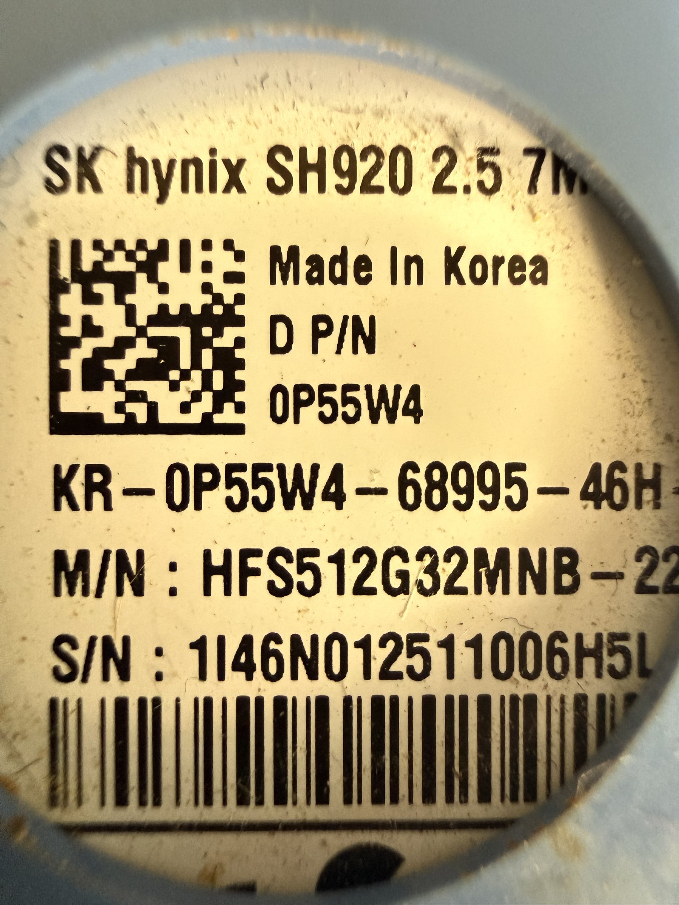

# SK Hynix SH920 512GB SSD

## Overview
A 2.5-inch SATA SSD manufactured by SK Hynix, model SH920 with 512 GB capacity. The drive carries a Dell part number (0P55W4), indicating it was originally sourced from a Dell system. The SK Hynix SH920 series uses NAND flash technology with a standard SATA III interface, providing reliable solid-state storage for laptops, desktops, and development systems.

## Identification
| Field | Value |
|-------|-------|
| Manufacturer | SK Hynix |
| Model | SH920 |
| Form Factor | 2.5" 7mm |
| Capacity | 512 GB |
| Dell P/N | 0P55W4 |
| M/N | HFS512G32MNB-22... |
| S/N | 1I46N012511006H5L |
| Origin | Made in Korea |

## Images
| Image | Description |
|-------|-------------|
|  | Drive label showing SK hynix SH920 2.5 7M, Dell P/N 0P55W4, M/N HFS512G32MNB, serial number, Made in Korea |

## Technical Specifications
- **Capacity**: 512 GB
- **Form Factor**: 2.5-inch, 7mm height
- **Interface**: SATA III (6 Gbps)
- **NAND Type**: MLC or TLC NAND Flash
- **Controller**: SK Hynix proprietary
- **Sequential Read**: ~530 MB/s (typical SATA III)
- **Sequential Write**: ~470 MB/s (typical)
- **Random 4K**: ~80K-90K IOPS
- **Endurance**: ~300 TBW (typical for 512GB)
- **Power**: 5V SATA power connector

## Development Interfaces
- **SATA III**: Standard 6 Gbps data interface
- **SATA Power**: Standard 15-pin SATA power connector
- **S.M.A.R.T.**: Drive health monitoring and telemetry
- **ATA Commands**: Standard ATA command set for low-level access
- **Firmware**: May support firmware updates via manufacturer tools

## Capabilities
- Fast solid-state storage for OS, applications, and data
- Low latency random access for development workflows
- No moving parts — vibration and shock resistant
- Drop-in replacement for any 2.5" SATA drive bay
- S.M.A.R.T. monitoring for predictive failure detection
- TRIM support for maintained performance over time

## Potential Development Projects
1. **NAS/Server Storage**: Use in a home server or NAS build for fast storage tier
2. **Portable Boot Drive**: Create a bootable development environment (Linux) on the SSD via USB-SATA adapter
3. **Data Recovery Lab Drive**: Use as a test/practice drive for data recovery tool development
4. **Disk Benchmark Suite**: Develop storage benchmarking tools and compare against other drives
5. **Raspberry Pi Fast Storage**: Connect via USB-SATA adapter to Raspberry Pi for high-speed storage
6. **S.M.A.R.T. Monitor Dashboard**: Build a drive health monitoring tool that reads and visualizes S.M.A.R.T. data

## Getting Started

### Required Tools
- SATA data cable
- SATA power connection (from PSU or adapter)
- USB-to-SATA adapter (for external use)
- 2.5" drive bay or mounting bracket

### Initial Setup
1. Connect via SATA to a computer or via USB-SATA adapter
2. Check drive health with CrystalDiskInfo or smartctl
3. Partition and format as needed (ext4, NTFS, APFS)
4. Run a benchmark (CrystalDiskMark or fio) to verify performance
5. Enable TRIM if using with an OS (fstrim or OS auto-TRIM)

## References
- SK Hynix SSD product specifications
- SATA III (6Gbps) interface standard
- S.M.A.R.T. attribute definitions
- Linux smartctl man page
