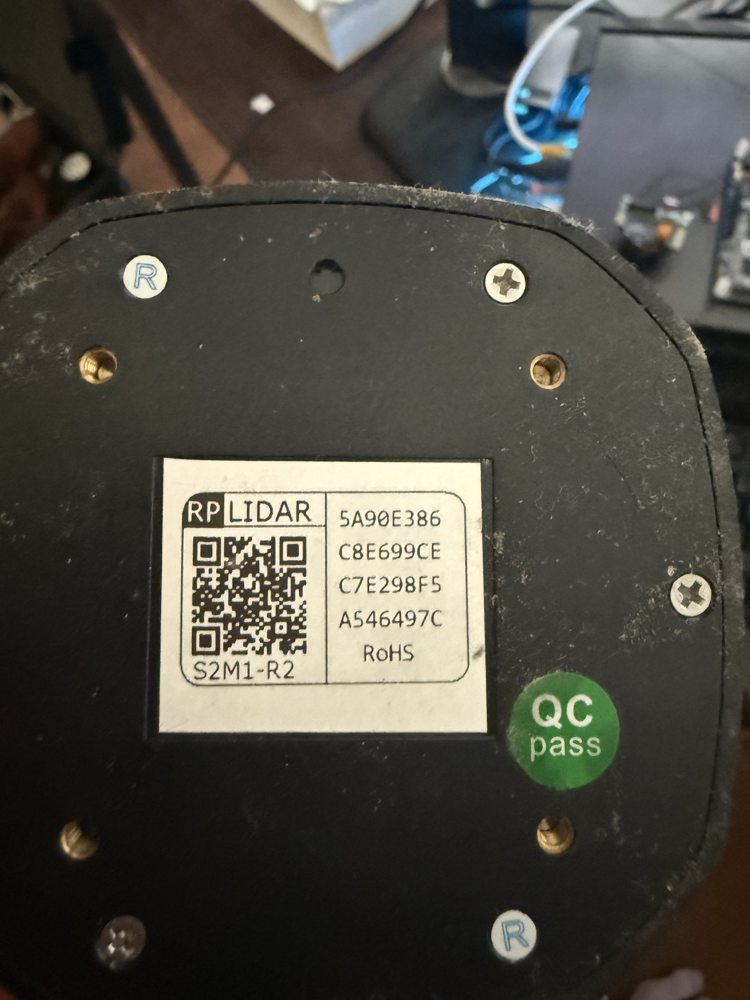

# Slamtec RPLIDAR S2M1-R2

## Overview
The RPLIDAR S2M1 is a 360-degree 2D laser scanner (LiDAR) made by Slamtec (now part of the RPLIDAR ecosystem). It provides high-precision distance measurements in a full 360-degree scan, making it ideal for robot navigation, SLAM (Simultaneous Localization and Mapping), and environment mapping. The S2M1 is a mid-range model offering improved performance over the A-series.

## Identification
| Field | Value |
|-------|-------|
| Manufacturer | Slamtec |
| Model | RPLIDAR S2M1-R2 |
| Type | 360-degree 2D LiDAR Scanner |
| Serial | 5A90E386 C8E699CE C7E298F5 A546497C |
| Compliance | RoHS |

## Images
| Image | Description |
|-------|-------------|
|  | Bottom view showing RP LIDAR label, S2M1-R2 model, QR code, and serial numbers |

## Technical Specifications
- **Scan Rate**: Up to 10 Hz (10 full 360° scans per second)
- **Range**: 0.1m to ~30m (typical for S2 series)
- **Angular Resolution**: ≤0.36° (1000+ samples per scan)
- **Laser**: 785nm infrared laser (Class 1 eye-safe)
- **Interface**: UART/USB (typically via included adapter)
- **Power**: 5V DC
- **Rotation**: Brushless motor for continuous 360° scanning
- **Accuracy**: ±30mm (typical)

## Development Interfaces
- **UART**: Serial communication at 256000 baud (default)
- **USB**: Via USB-to-UART adapter board (often included)
- **Motor Control**: PWM signal for motor speed control
- **Power**: 5V DC input

## Capabilities
- Full 360-degree environment scanning
- Real-time distance measurement in 2D plane
- SLAM (Simultaneous Localization and Mapping)
- Obstacle detection and avoidance
- Room/floor plan mapping
- Dynamic object tracking
- Compatible with ROS/ROS2

## Potential Development Projects
1. **Autonomous Robot Navigator**: Integrate with a mobile robot platform for autonomous navigation using ROS2 Nav2 stack
2. **Room Mapper**: Build a portable room scanning device that generates accurate 2D floor plans
3. **Security Perimeter Monitor**: Create a stationary security system that detects and tracks movement in a defined area
4. **Smart Vacuum Path Planner**: Develop SLAM-based intelligent path planning for robotic vacuum applications
5. **Interactive LiDAR Art Installation**: Create a real-time interactive display that responds to people's positions in a room

## Getting Started

### Required Tools
- USB cable (Micro-B or as provided with adapter board)
- Slamtec RPLIDAR SDK (C/C++ or Python)
- ROS/ROS2 (optional, for robotics integration)
- Python with matplotlib for scan visualization

### Initial Setup
1. Connect the RPLIDAR to the USB adapter board
2. Plug into computer via USB cable
3. Install the RPLIDAR SDK or `rplidar` Python package (`pip install rplidar-roboticia`)
4. Run the included scan viewer to verify the unit is scanning
5. For ROS2: install the `rplidar_ros` package and launch the node
6. Visualize scans in RViz2 or with the Python matplotlib viewer

## References
- Slamtec RPLIDAR S2 product page
- RPLIDAR SDK on GitHub (Slamtec/rplidar_sdk)
- rplidar_ros ROS2 package
- RPLIDAR protocol documentation
