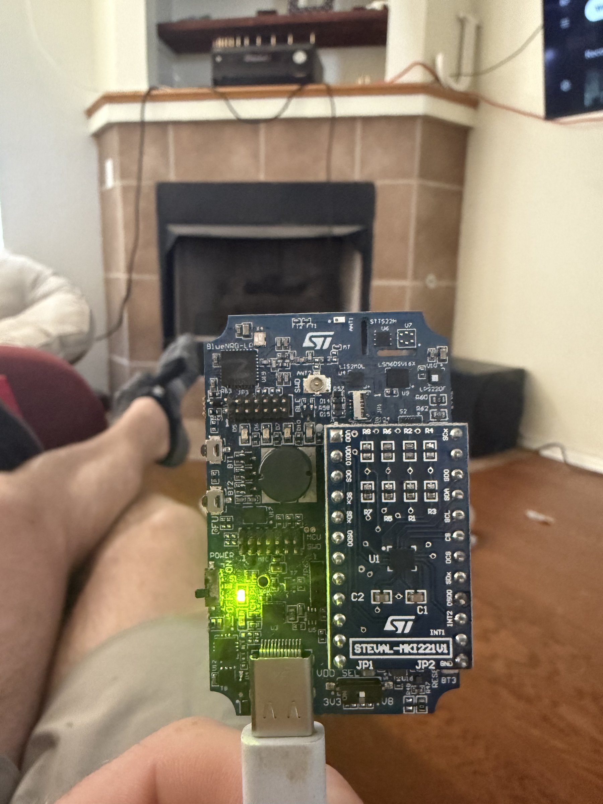

# ST BlueNRG-LP + STEVAL-MKI221V1 Sensor Board

## Overview
This is a two-board stack from STMicroelectronics combining the BlueNRG-LP Bluetooth Low Energy evaluation platform with the STEVAL-MKI221V1 sensor adapter board. The BlueNRG-LP board provides BLE connectivity and MCU processing, while the STEVAL-MKI221V1 adds sensor evaluation capabilities. The stack was photographed powered on via USB-C with a green status LED illuminated, showing both the BlueNRG-LP main board and the MKI221V1 daughter board attached.

## Identification
| Field | Value |
|-------|-------|
| Manufacturer | STMicroelectronics |
| Sensor Board | STEVAL-MKI221V1 |
| Main Board | BlueNRG-LP Evaluation Platform |
| Type | BLE + Sensor Evaluation Kit |
| Visible Sensors | STS22H (temperature), LSM6DSV16X (IMU), LPS22DF (pressure) |
| Power | USB-C |

## Images
| Image | Description |
|-------|-------------|
|  | Full board stack powered on, showing BlueNRG-LP base board with STEVAL-MKI221V1 sensor daughter board, green LED active, USB-C connected |

## Technical Specifications

### BlueNRG-LP Board
- **MCU**: BlueNRG-LP (ARM Cortex-M0+, 64 MHz)
- **Bluetooth**: BLE 5.2 with integrated radio
- **Flash**: 256 KB
- **SRAM**: 64 KB
- **Power**: Ultra-low-power modes, USB-C powered

### STEVAL-MKI221V1 Sensor Board
- **STS22H**: High-accuracy digital temperature sensor (±0.5°C)
- **LSM6DSV16X**: 6-axis IMU (accelerometer + gyroscope) with AI core
- **LPS22DF**: Barometric pressure sensor (260-1260 hPa)
- **Interface**: I2C/SPI to host board via DIL24 connector

## Development Interfaces
- **USB-C**: Programming and power
- **SWD**: Debug/programming header
- **BLE**: Over-the-air communication and firmware update
- **I2C**: Sensor bus (SCL, SDA, INT1, INT2 exposed)
- **SPI**: Alternative sensor interface
- **GPIO**: Buttons (BT1, BT2), LEDs, DFU pin

## Capabilities
- Bluetooth Low Energy 5.2 wireless communication
- Multi-sensor data fusion (temperature, motion, pressure)
- AI-based motion classification (via LSM6DSV16X Machine Learning Core)
- Ultra-low-power operation for battery-powered applications
- Over-the-air firmware updates
- Environmental monitoring (temperature, pressure, altitude)
- Motion detection and gesture recognition

## Potential Development Projects
1. **BLE Environmental Monitor**: Stream real-time temperature, pressure, and altitude data to a smartphone app via BLE
2. **AI Motion Classifier**: Train the LSM6DSV16X Machine Learning Core to recognize custom activities or gestures
3. **Indoor Navigation Beacon**: Use BLE advertising + barometric altitude for indoor positioning assistance
4. **Wearable Health Tracker Prototype**: Build a compact wearable that tracks activity, temperature, and altitude changes
5. **Weather Station Node**: Deploy as a wireless weather data collector in a mesh network

## Getting Started

### Required Tools
- USB-C cable
- STM32CubeIDE or BlueNRG-LP SDK
- STMicroelectronics BlueST-SDK or ST BLE Sensor app (iOS/Android)
- STSW-BLUENRG-LP software package

### Initial Setup
1. Connect via USB-C to power and program
2. Install the BlueNRG-LP SDK and development tools
3. Flash the sensor demo firmware
4. Install ST BLE Sensor app on your phone
5. Pair via BLE and view real-time sensor data
6. Explore the STM32Cube.AI integration for ML on the sensor data

## References
- STEVAL-MKI221V1 datasheet on st.com
- BlueNRG-LP evaluation platform user manual
- ST BLE Sensor mobile app
- LSM6DSV16X Machine Learning Core application notes
