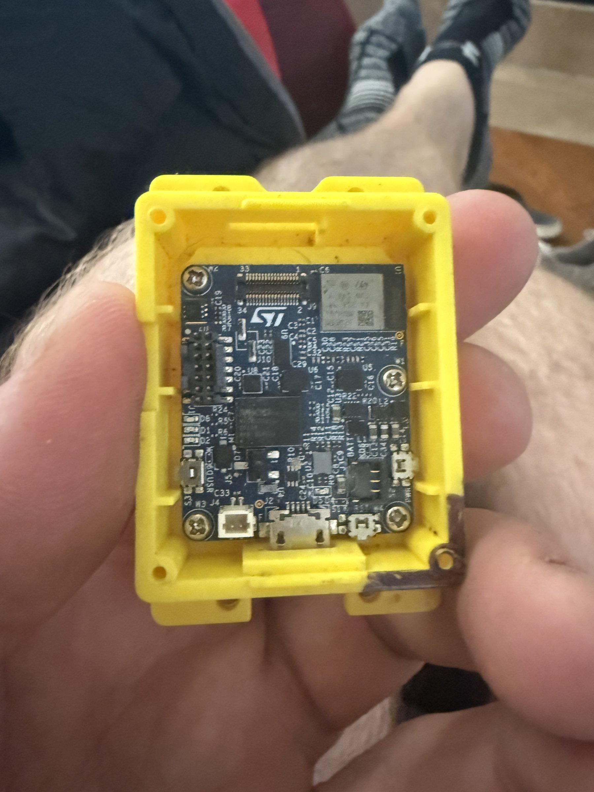

# ST SensorTile.box (Compact Wireless Sensor Kit)

## Overview
A compact STMicroelectronics wireless sensor development board housed in a yellow 3D-printed case. The board features an ST MCU with wireless connectivity (likely STM32WB series), various onboard sensors, and a micro-USB connector for programming and charging. The small form factor and integrated wireless make this ideal for IoT prototyping and wearable sensor applications.

## Identification
| Field | Value |
|-------|-------|
| Manufacturer | STMicroelectronics |
| Type | Compact Wireless Sensor Dev Kit |
| MCU | STM32WB series (BLE + MCU) |
| Enclosure | Yellow 3D-printed case |
| Interface | Micro-USB |
| Power | USB or LiPo battery |

## Images
| Image | Description |
|-------|-------------|
|  | Top view of board in yellow 3D-printed enclosure showing ST MCU, wireless module with QR code, micro-USB port, and various surface-mount components |

## Technical Specifications
- **Processor**: ARM Cortex-M4 (STM32WB series, dual-core with M0+ for BLE)
- **Wireless**: Bluetooth Low Energy 5.x
- **Sensors**: Likely includes accelerometer, gyroscope, magnetometer, temperature, pressure, humidity (typical for SensorTile family)
- **Storage**: Onboard flash
- **Connector**: Micro-USB for programming/charging
- **Battery**: LiPo battery support via JST connector
- **Size**: ~40x25mm PCB in protective case

## Development Interfaces
- **Micro-USB**: Programming, debugging, and power
- **SWD**: Debug interface (may require case removal)
- **BLE**: Over-the-air communication and OTA updates
- **I2C/SPI**: Internal sensor buses
- **GPIO**: Limited external access depending on case design

## Capabilities
- Bluetooth Low Energy wireless data streaming
- Multi-sensor environmental and motion monitoring
- Battery-powered portable operation
- Compact form factor for wearable/embedded deployment
- Data logging to internal flash
- Wireless firmware updates

## Potential Development Projects
1. **Portable Vibration Analyzer**: Use the accelerometer for industrial vibration monitoring with BLE data streaming
2. **Asset Tracker**: Combine BLE beaconing with motion detection for indoor asset tracking
3. **Sleep Quality Monitor**: Track movement patterns during sleep and stream data to a phone app
4. **Structural Health Monitor**: Deploy on structures to detect and report vibration anomalies
5. **Compact Weather Logger**: Log environmental data (temp, humidity, pressure) to flash with periodic BLE sync

## Getting Started

### Required Tools
- Micro-USB cable
- STM32CubeIDE or equivalent
- ST BLE Sensor app (iOS/Android)
- STM32CubeProgrammer for firmware flashing

### Initial Setup
1. Connect via micro-USB to power the board
2. Check if demo firmware is pre-loaded (may advertise via BLE immediately)
3. Install ST BLE Sensor app and scan for the device
4. For custom development, install STM32CubeIDE and the appropriate firmware package
5. Flash custom firmware via USB or SWD

## References
- STMicroelectronics SensorTile.box product family
- STM32WB series reference manual
- ST BLE Sensor mobile application
- STM32CubeWB firmware package
