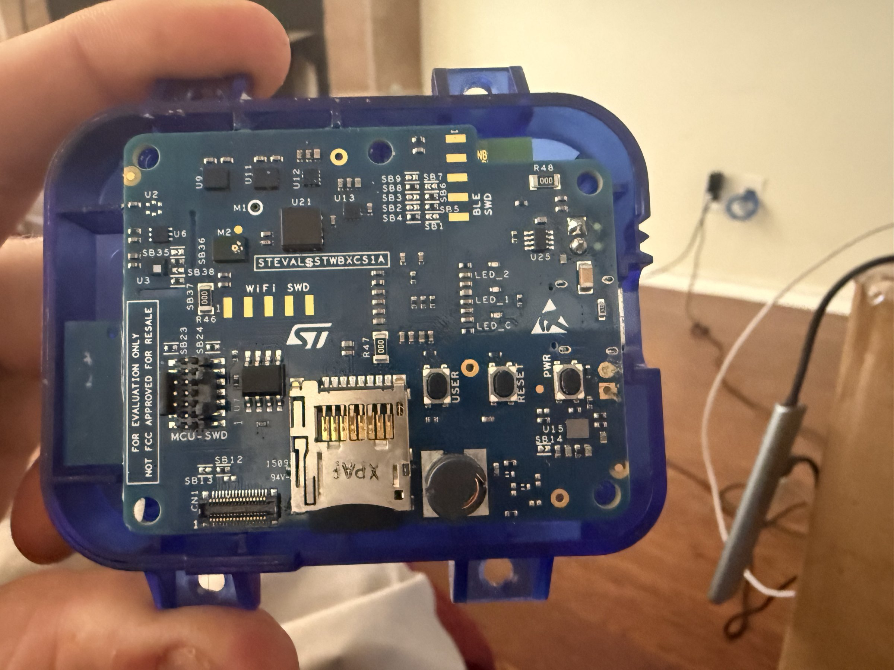

# STEVAL-STWINBX CS1A (SensorTile Wireless Industrial Node)

## Overview
The STEVAL-STWINBX CS1A is STMicroelectronics' SensorTile Wireless Industrial Node Board X — a professional-grade sensor evaluation platform designed for industrial IoT applications. It features WiFi, BLE, and an extensive sensor suite in a compact form factor with a translucent blue protective case. The board includes a micro-SD slot for data logging, multiple SWD debug interfaces (WiFi, BLE, MCU), and is marked "FOR EVALUATION ONLY - NOT FCC APPROVED FOR RESALE."

## Identification
| Field | Value |
|-------|-------|
| Manufacturer | STMicroelectronics |
| Model | STEVAL-STWINBX CS1A |
| Type | Wireless Industrial Sensor Node |
| Enclosure | Translucent blue protective case |
| Compliance | Evaluation only (not FCC approved for resale) |
| Power | USB / Battery |

## Images
| Image | Description |
|-------|-------------|
|  | Top view showing PCB in blue case with WiFi SWD, BLE SWD, MCU-SWD headers, micro-SD slot, USER/RESET/PWR buttons, LED indicators, and ST logo |

## Technical Specifications
- **Main MCU**: STM32U5 series (ultra-low-power, ARM Cortex-M33)
- **Wireless**: Dual-radio — WiFi + Bluetooth Low Energy
- **Sensors**: Industrial-grade sensor suite including:
  - High-accuracy accelerometer and gyroscope
  - Magnetometer
  - Temperature and humidity sensor
  - Barometric pressure sensor
  - Digital microphone (MEMS)
  - Possible: vibration sensor, analog front-end
- **Storage**: Micro-SD card slot for offline data logging
- **Buttons**: USER, RESET, PWR
- **LEDs**: LED_1, LED_2, LED_C indicators
- **Debug**: Three SWD headers (WiFi SWD, BLE SWD, MCU-SWD)

## Development Interfaces
- **MCU-SWD**: Main MCU debug/programming header
- **WiFi SWD**: WiFi module debug interface
- **BLE SWD**: BLE module debug interface
- **USB**: Programming, power, and virtual COM port
- **Micro-SD**: FAT filesystem data logging
- **I2C/SPI**: Internal sensor buses
- **GPIO**: Exposed solder bridges (SB1-SB38) for configuration

## Capabilities
- Dual wireless connectivity (WiFi + BLE simultaneously)
- Industrial vibration monitoring and predictive maintenance
- High-fidelity audio capture via MEMS microphone
- Environmental monitoring (temperature, humidity, pressure)
- Local data logging to micro-SD card
- Ultra-low-power operation for battery deployment
- Edge AI/ML processing on STM32U5
- Cloud connectivity via WiFi

## Potential Development Projects
1. **Predictive Maintenance System**: Monitor industrial equipment vibration patterns, detect anomalies, and alert via WiFi/cloud
2. **Environmental Compliance Monitor**: Track and log temperature, humidity, and pressure for regulatory compliance in warehouses/labs
3. **Acoustic Anomaly Detector**: Use the MEMS microphone for machine sound analysis and fault detection
4. **Multi-Sensor Data Fusion Dashboard**: Build a web dashboard that aggregates all sensor data via WiFi in real-time
5. **Edge AI Activity Classifier**: Deploy TinyML models on the STM32U5 for on-device activity or vibration classification

## Getting Started

### Required Tools
- USB cable (Micro-B or as specified)
- STM32CubeIDE
- STM32CubeProgrammer
- ST BLE Sensor app (for BLE testing)
- Micro-SD card (FAT32 formatted) for data logging

### Initial Setup
1. Remove the case to access the SWD headers if needed
2. Connect via USB for power and initial programming
3. Install the STEVAL-STWINBX firmware package from STMicroelectronics
4. Flash the sensor demo firmware
5. Insert a micro-SD card for data logging
6. Use ST BLE Sensor app to verify BLE connectivity
7. Configure WiFi credentials for cloud connectivity

## References
- STEVAL-STWINBX product page on st.com
- SensorTile Wireless Industrial Node documentation
- STM32CubeU5 firmware package
- FP-SNS-STBOX1 function pack for sensor applications
