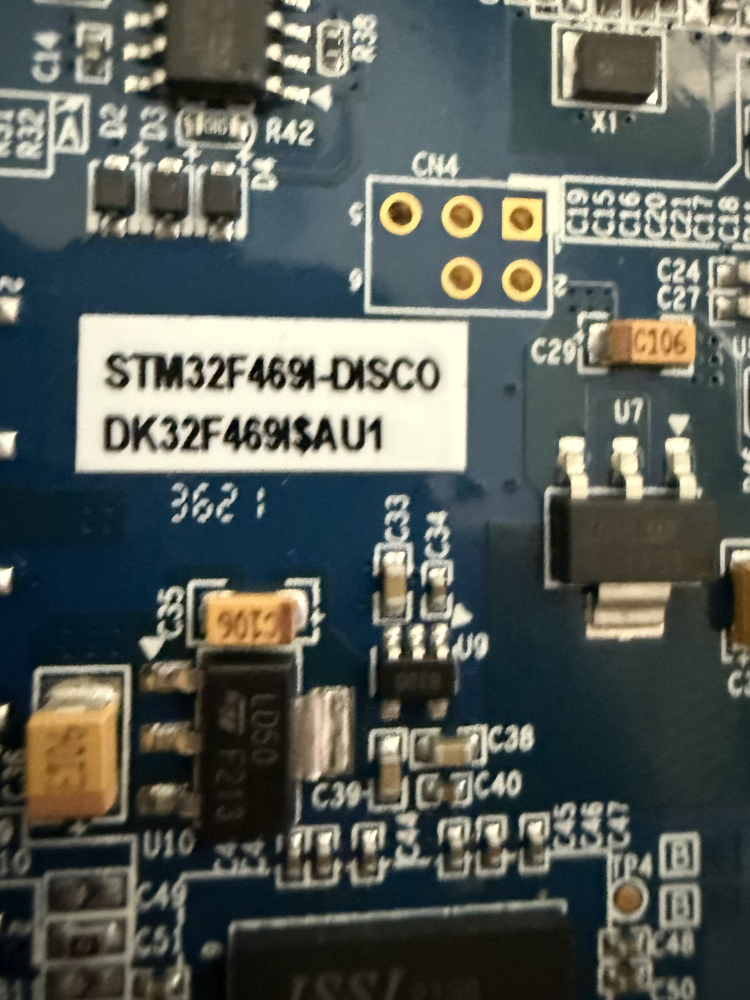

# STM32F469I-DISCO Discovery Board

## Overview
The STM32F469I-DISCO is a full-featured Discovery board from STMicroelectronics built around the STM32F469NIH6 microcontroller. It features a 4-inch 800x480 MIPI-DSI touchscreen display, making it ideal for GUI development, embedded graphics, and multimedia applications. The board provides a rich set of peripherals and is supported by the STM32Cube ecosystem.

## Identification
| Field | Value |
|-------|-------|
| Manufacturer | STMicroelectronics |
| Model | STM32F469I-DISCO |
| Board ID | DK32F469ISAU1 |
| Type | Microcontroller Discovery Board |
| MCU | STM32F469NIH6 (ARM Cortex-M4, 180 MHz) |
| Power | USB or external 5V |

## Images
| Image | Description |
|-------|-------------|
|  | Close-up of board label showing STM32F469I-DISCO identifier and component layout |

## Technical Specifications
- **Processor**: ARM Cortex-M4 @ 180 MHz with FPU
- **Flash**: 2 MB
- **SRAM**: 384 KB + 4 KB backup SRAM
- **Display**: 4-inch 800x480 MIPI-DSI TFT touchscreen (capacitive)
- **External Memory**: 16 MB SDRAM, 16 MB Quad-SPI Flash
- **Audio**: SAI audio codec (CS43L22), MEMS microphone
- **Camera**: DCMI camera interface
- **Storage**: microSD card slot
- **Connectivity**: USB OTG HS/FS, Ethernet-ready (RMII)
- **Debug**: ST-LINK/V2-1 integrated debugger/programmer

## Development Interfaces
- **SWD/JTAG**: Integrated ST-LINK/V2-1 with SWD debug
- **USB**: Micro-USB OTG (HS and FS), Micro-USB for ST-LINK
- **UART**: Via ST-LINK virtual COM port
- **Arduino Headers**: Compatible with Arduino Uno R3 shields
- **GPIO**: Extended headers for additional I/O access
- **I2C/SPI/I2S**: Available through expansion headers
- **MIPI-DSI**: Display Serial Interface for LCD

## Capabilities
- High-performance embedded graphics with ChromART (DMA2D) accelerator
- MIPI-DSI display interface for high-resolution GUI development
- Audio playback and recording
- Camera image capture and processing
- USB host and device modes
- SD card storage for data logging
- Capacitive touchscreen input
- Hardware cryptographic acceleration (AES, HASH, RNG)

## Potential Development Projects
1. **Embedded GUI Dashboard**: Build a real-time sensor dashboard using TouchGFX or LVGL graphics libraries on the 4-inch touchscreen
2. **Camera Vision System**: Connect a DCMI-compatible camera module for image capture and basic computer vision processing
3. **Audio Processing Station**: Develop an audio effects processor or spectrum analyzer using the onboard codec and DSP capabilities
4. **IoT Gateway Prototype**: Use as a gateway device with ethernet and USB connectivity, displaying connected device status on the touchscreen
5. **Retro Game Console**: Build a handheld gaming device leveraging the touchscreen, audio output, and GPU acceleration

## Getting Started

### Required Tools
- USB Micro-B cable (2x recommended: one for ST-LINK, one for USB OTG)
- STM32CubeIDE (free) or IAR/Keil
- STM32CubeMX for peripheral configuration
- Optional: TouchGFX Designer for GUI development

### Initial Setup
1. Download and install STM32CubeIDE from st.com
2. Connect the board via the ST-LINK USB connector
3. ST-LINK driver should auto-install; verify in Device Manager
4. Create a new STM32 project targeting the STM32F469I-DISCO board
5. Flash the demo firmware to verify board functionality
6. Install TouchGFX Designer for GUI-based development

## References
- STM32F469I-DISCO product page on st.com
- STM32F469xx reference manual (RM0386)
- STM32CubeF4 firmware package
- TouchGFX documentation for STM32
